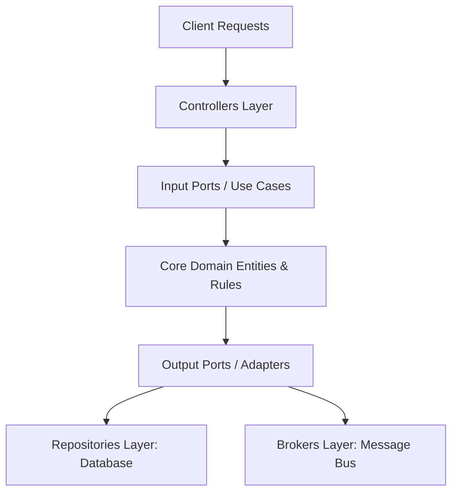

# Frontend Arena: Backend Engineering Blueprint (v1.0)

This document is the official Backend Engineering Blueprint for **Frontend Arena**. It outlines the software design patterns, project directories, component interfaces, request lifecycles, and security frameworks to guide development teams.

---

## Section 1: Backend Architecture & Software Patterns

### 1. Purpose
Defines the software architecture, modular boundaries, and communication paradigms to ensure the codebase remains maintainable as the team scales.

### 2. Architecture
Frontend Arena adopts a **Modular Monolith** pattern incorporating **Clean Architecture / Hexagonal (Ports & Adapters)** principles inside each module.



*   **Core Domain (Center):** Stateless business logic and domain entities. Has no outer dependencies.
*   **Use Cases (Services):** Application-specific logic coordinates domain entities.
*   **Infrastructure (Adapters):** Database repositories, REST/gRPC controllers, and Kafka event publishers.

### 3. Responsibilities
*   *Domain Layer:* House immutable business rules.
*   *Service Layer:* Coordinate transactions and orchestrate domain workflows.
*   *Infrastructure Layer:* Manage database integrations, routing adapters, and cache connections.

### 4. Best Practices
*   Isolate core domain entities from database ORM decorators. Use data mapping utilities to convert database rows to domain models.
*   Enforce dependency inversion: controllers must depend on service interfaces, not implementation classes.

### 5. Security Considerations
*   Never leak database models directly to API outputs. Wrap all response schemas in explicit Data Transfer Objects (DTOs).

### 6. Scalability Strategy
By decoupling domain logic from databases and frameworks, high-load modules (like evaluations) can be converted into standalone services with minimal refactoring.

### 7. Trade-offs
*   *Con:* Increased boilerplate code (mappers, interfaces, and DTOs).
*   *Pro:* Testability, long-term codebase health, and simplified service extraction.

### 8. Future Improvements
Introduce automated architecture checks (e.g., using ArchUnit equivalent tools) to enforce dependency import rules during CI builds.

---

## Section 2: Project Directory Structure

### 1. Purpose
Defines the directory layout for all application code, ensuring consistency across modules.

### 2. Architecture

```
frontend-arena-backend/
├── apps/
│   └── api-server/              # Main entry point bootstrapping modules
├── src/
│   ├── core/                    # Core configuration and middleware
│   │   ├── config/              # Environment configurations
│   │   ├── guards/              # Authentication guards
│   │   ├── interceptors/        # Request/Response interceptors
│   │   └── middleware/          # Rate limiting and CORS filters
│   ├── modules/                 # Bounded DDD contexts
│   │   ├── authentication/
│   │   ├── evaluation/
│   │   └── submissions/
│   └── shared/                  # Shared utilities and types
│       ├── constants/
│       ├── decorators/
│       └── exceptions/
├── workers/                     # Background job processors
└── package.json
```

### 3. Responsibilities
*   `apps/api-server`: Configures Dependency Injection, setups HTTP/WebSocket servers, and boots modules.
*   `src/modules/`: Contains business logic, separated into clean layers.
*   `src/shared/`: Reusable helpers like loggers, DTO base classes, and exception wrappers.

### 4. Best Practices
*   Enforce strict package visibility rules: packages in `modules/` must not import other modules' internal controllers or repositories.

### 5. Security Considerations
*   Restrict write access to the `src/core/config/` directory to prevent unauthorized changes to database connection parameters.

### 6. Scalability Strategy
The directory layout maps to a standard monorepo structure, enabling teams to split modules into standalone codebases when needed.

### 7. Trade-offs
*   *Con:* Monorepos can result in large build footprints if not configured with optimized workspace dependency caching.
*   *Pro:* Simplified dependency updates and unified developer setups.

### 8. Future Improvements
Configure Turborepo pipelines to cache compilation tasks and parallelize testing loops.

---

## Section 3: Bounded Modules Specification

Every module within the `src/modules/` directory must declare a unified interface structure:
*   **Internal Service:** Internal domain logic.
*   **Controller Layer:** Exposes REST, WebSocket, or gRPC endpoints.
*   **Exporter Module:** Defines the public API (interfaces, events) available to other modules.

### 1. Core Modules Mapping
1.  **Authentication:** Handles signup, login, session validation, and JWT signing. Exports `AuthGuard` and token checkers.
2.  **Submissions:** Validates repository links, captures webhook triggers, and queues build checks. Exports submission lookup services.
3.  **Evaluation:** Spawns sandbox execution containers, runs test suites, and processes scorecard ratings. Exports evaluation data helpers.
4.  **Leaderboards:** recycles scores, computes ranks, and updates Redis Sorted Sets. Dependencies: Evaluation Service.
5.  **Notifications:** Manages push alerts and transactional emails. Exports notification dispatchers.

---

## Section 4: Request Lifecycle Flow

### 1. Purpose
Tracks the sequence of middleware, validation checks, and query handlers execution for incoming requests.

### 2. Recommended Lifecycle Diagram

```
[Browser Client] 
      │ (HTTPS/WSS)
      ▼
[API Gateway] ──────── (Terminates TLS, runs global rate limits)
      │
      ▼
[Middleware Layer] ─── (Helmet headers, CORS, Compression)
      │
      ▼
[Authentication] ───── (JWT parsing, session token verification)
      │
      ▼
[Route Guards] ─────── (RBAC / Domain permissions validation)
      │
      ▼
[Validator Layer] ──── (DTO schema validation, class-validator)
      │
      ▼
[Controller] ───────── (Route mapping, extracts params)
      │
      ▼
[Service / UseCase] ── (Orchestrates domain logic, database tx)
      │
      ▼
[Repository] ───────── (Executes SQL, returns entity data)
      │
      ▼
[Response Wrapper] ─── (Formats unified JSON schema payload)
```

---

## Section 5: Shared Infrastructure Components

To maintain consistent error handling, logging, and pagination layouts across all services, developers must use the shared library components:

### 1. Structured Logging Adapter
*   Logs outputs to `stdout` in structured JSON format containing timestamp details, log severity labels, correlation IDs, and transaction scopes.

### 2. Standardized Response Wrapper
*   All successful API responses must return a structured JSON envelope:
    ```json
    {
      "success": true,
      "data": {},
      "meta": {
        "pageCursor": "...",
        "count": 100
      }
    }
    ```

---

## Section 6: Background Worker Pools & Event Triggers

### 1. Queue Workers
*   **Evaluation Workers:** Run on separate container nodes, executing Docker-based test pipelines.
*   **Notification Workers:** Buffer email, WhatsApp, and push notifications requests, processing them through provider integrations with rate-limiting backoffs.
*   **Certificate Workers:** Load credentials template images, run PDF renders, sign documents, and upload outputs to Cloudflare R2 storage.

### 2. Event-Driven Messaging (Kafka Integration)
When database writes finish, use the Outbox Pattern to publish event payloads (e.g., `SubmissionCreated`, `EvaluationCompleted`) to Kafka. This ensures reliable event delivery and prevents data discrepancies if the message broker drops connections.

---

## Section 7: Unified Security Specifications

*   **Rate Limiting:** Gateway rate-limiting restricts requests based on IP and authenticated token keys. Core API: 100 req/min. Login: 5 req/min.
*   **Helmet Headers:** Enforces security headers (HSTS, CSP, Frame Options) to mitigate XSS and clickjacking vulnerabilities.
*   **Secrets Management:** Environment variables are populated at launch from HashiCorp Vault. Hardcoding secrets in repository configurations is strictly prohibited.
