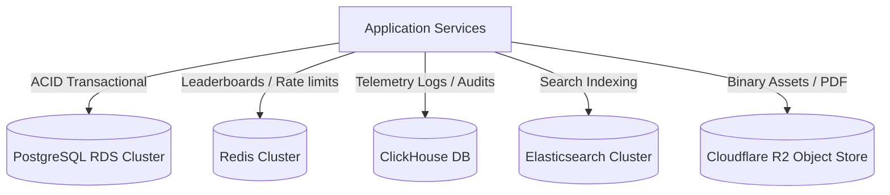
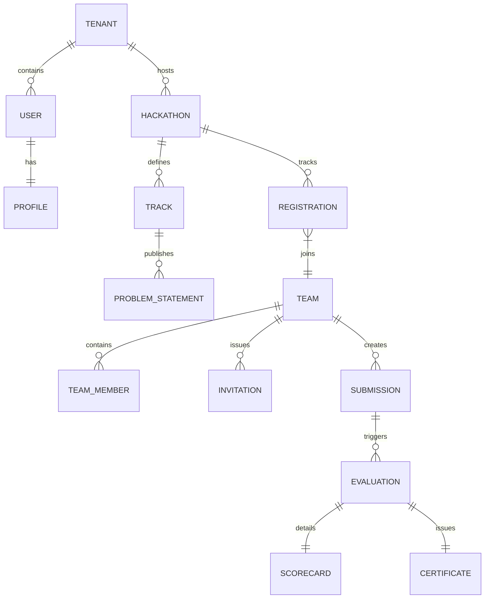

# Frontend Arena: Database Architecture Specification (v1.0)

This document is the official Database Architecture Blueprint for **Frontend Arena**. It outlines the data storage layers, table schematics, indexing, normalization rules, audit systems, multi-tenancy configurations, and security constraints required to scale the platform.

---

## Section 1: Database Architecture Overview

Frontend Arena implements a multi-model database strategy, placing specific data workloads in optimized engines:

*   **Primary DB: PostgreSQL:** Chosen for its strict ACID properties, relational integrity, mature indexing, and support for JSONB (for flexible semi-structured profile data).
*   **Cache Store: Redis:** Handles real-time leaderboards (via Sorted Sets), API rate limiting, and temporary JWT blocklists.
*   **Search Database: Elasticsearch:** Syncs index profiles for fast fuzzy keyword sourcing queries by recruiters.
*   **Analytics Database: ClickHouse:** Handles telemetry metrics, event logs, and compile/execution log trails.
*   **Object Storage: Cloudflare R2:** S3-compatible, zero-egress storage for PDF certificates, screenshots, and pitch decks.

---

## Section 2: Entity Relationship Diagram (ERD)

The relationship boundaries across the core modules are modeled below:

---

## Section 3: Bounded DB Modules & Table Design

### 1. Module: Authentication & Users

#### Table 1: `users`
*   **Purpose:** The central identity table containing credentials and tenant association references.
*   **Columns:**
    *   `id`: UUID (Primary Key, Default: `gen_random_uuid()`)
    *   `tenant_id`: UUID (Foreign Key -> `tenants.id`, Not Null)
    *   `email`: VARCHAR(255) (Unique, Not Null)
    *   `password_hash`: VARCHAR(255) (Nullable, for OAuth accounts)
    *   `role`: VARCHAR(50) (Default: 'PARTICIPANT', Not Null)
    *   `is_mfa_enabled`: BOOLEAN (Default: `false`)
    *   `created_at`: TIMESTAMPTZ (Default: `NOW()`)
    *   `deleted_at`: TIMESTAMPTZ (Nullable, for soft delete)
*   **Relationships:** One-to-Many with `user_sessions`, One-to-One with `profiles`, Many-to-Many with `teams`.
*   **Constraints:** `UNIQUE(tenant_id, email)` (users are isolated by tenant).
*   **Indexes:** B-tree index on `(tenant_id, email)`.
*   **Security Notes:** Column `password_hash` is encrypted using Argon2id.
*   **Growth Strategy:** Table partitioned by `tenant_id` hash values for global scalability.

#### Table 2: `profiles`
*   **Purpose:** Houses developer resume data, portfolio details, and XP rankings.
*   **Columns:**
    *   `user_id`: UUID (Primary Key, Foreign Key -> `users.id`)
    *   `first_name`: VARCHAR(100) (Not Null)
    *   `last_name`: VARCHAR(100) (Not Null)
    *   `skills`: JSONB (Default: `[]`)
    *   `xp_level`: INT (Default: `1`)
    *   `xp_score`: INT (Default: `0`)
    *   `updated_at`: TIMESTAMPTZ (Default: `NOW()`)
*   **Relationships:** One-to-One with `users`.
*   **Constraints:** `PRIMARY KEY(user_id)`.
*   **Indexes:** GIN index on `skills` to allow fast JSON query lookups.
*   **Security Notes:** JSONB data is scrubbed of PII for search listings.
*   **Growth Strategy:** Regularly updated columns (like `xp_score`) are cached in Redis to minimize writes to the database.

---

### 2. Module: Organizations & Hackathons

#### Table 3: `tenants` (Organizations)
*   **Purpose:** Master tenant record defining college, corporate, or community spaces.
*   **Columns:**
    *   `id`: UUID (Primary Key)
    *   `name`: VARCHAR(255) (Not Null)
    *   `custom_domain`: VARCHAR(255) (Unique, Nullable)
    *   `branding_config`: JSONB (Colors, logo settings)
    *   `tier`: VARCHAR(50) (Default: 'FREE', Not Null)
*   **Relationships:** One-to-Many with `users`, `hackathons`.
*   **Constraints:** `UNIQUE(custom_domain)`.
*   **Indexes:** B-tree index on `custom_domain`.
*   **Security Notes:** Tenant keys are verified at the gateway routing level.

#### Table 4: `hackathons`
*   **Purpose:** Core event settings, timeline tracks, and rule catalogs.
*   **Columns:**
    *   `id`: UUID (Primary Key)
    *   `tenant_id`: UUID (Foreign Key -> `tenants.id`)
    *   `title`: VARCHAR(255) (Not Null)
    *   `status`: VARCHAR(50) (Default: 'DRAFT', Not Null)
    *   `starts_at`: TIMESTAMPTZ (Not Null)
    *   `ends_at`: TIMESTAMPTZ (Not Null)
*   **Relationships:** One-to-Many with `tracks`, `registrations`.
*   **Constraints:** `CHECK(ends_at > starts_at)`.
*   **Indexes:** B-tree index on `(tenant_id, status)`.
*   **Security Notes:** Write actions are restricted to tenant admins.

---

### 3. Module: Teams & Submissions

#### Table 5: `teams`
*   **Purpose:** Groups participant configurations under shared hackathon registrations.
*   **Columns:**
    *   `id`: UUID (Primary Key)
    *   `hackathon_id`: UUID (Foreign Key -> `hackathons.id`)
    *   `name`: VARCHAR(100) (Not Null)
    *   `invite_code`: VARCHAR(50) (Unique, Not Null)
    *   `captain_id`: UUID (Foreign Key -> `users.id`)
*   **Relationships:** One-to-Many with `team_members`, `submissions`.
*   **Constraints:** `UNIQUE(hackathon_id, name)`.

#### Table 6: `submissions`
*   **Purpose:** Track git repository details, build files, and deployment links.
*   **Columns:**
    *   `id`: UUID (Primary Key)
    *   `team_id`: UUID (Foreign Key -> `teams.id`)
    *   `git_repo_url`: VARCHAR(512) (Not Null)
    *   `live_demo_url`: VARCHAR(512) (Nullable)
    *   `submission_status`: VARCHAR(50) (Default: 'PENDING')
    *   `created_at`: TIMESTAMPTZ (Default: `NOW()`)
*   **Relationships:** One-to-Many with `evaluations`.
*   **Indexes:** B-tree index on `(team_id, submission_status)`.
*   **Growth Strategy:** Log outputs are partitioned out of PostgreSQL into ClickHouse.

---

### 4. Module: Evaluations & Scoring

#### Table 7: `evaluations`
*   **Purpose:** Captures automated pipeline results and manual scorecard grades.
*   **Columns:**
    *   `id`: UUID (Primary Key)
    *   `submission_id`: UUID (Foreign Key -> `submissions.id`)
    *   `automated_score`: NUMERIC(5,2) (Default: `0.00`)
    *   `manual_score`: NUMERIC(5,2) (Default: `0.00`)
    *   `final_score`: NUMERIC(5,2) (Default: `0.00`)
    *   `evaluation_status`: VARCHAR(50) (Default: 'IN_PROGRESS')
*   **Relationships:** One-to-One with `scorecards`.

#### Table 8: `scorecards`
*   **Purpose:** Detailed breakdowns of manual scores based on rubric criteria.
*   **Columns:**
    *   `id`: UUID (Primary Key)
    *   `evaluation_id`: UUID (Foreign Key -> `evaluations.id`)
    *   `scores_json`: JSONB (Breakdown of scores per criteria: UI/UX, Code, etc.)
    *   `judge_notes`: TEXT (Nullable)
*   **Indexes:** B-tree index on `evaluation_id`.

---

## Section 4: Relationships & Cascade Rules

*   **Tenant Deletion:** Cascades down (`ON DELETE CASCADE`) to clean up all users, hackathons, and submissions, maintaining multi-tenant hygiene.
*   **Evaluation Logs:** Cascading deletion is blocked (`ON DELETE RESTRICT`) for completed reviews to preserve historical integrity.

---

## Section 5: Indexing Strategy

*   **Covering B-Tree Index:** Installed on `users(tenant_id, email, password_hash)` to optimize login query performance.
*   **Leaderboard Composite Index:** Installed on `submissions(team_id, created_at)` to query project histories quickly.
*   **Search GIN Index:** Installed on `profiles(skills)` to query developer profiles based on specific skill combinations.

---

## Section 6: Database Normalization & Performance Denormalizations

### 1. Normalization Level (3NF)
All relational tables are structured in **Third Normal Form (3NF)** to eliminate data redundancy and prevent update anomalies.

### 2. Intentional Denormalization
*   `evaluations.final_score`: Replicated directly in the table instead of recalculating values from sub-scores on every query, optimizing leaderboard performance.
*   `profiles.xp_score`: Cached in Redis for fast updates during active hackathons, and synced back to PostgreSQL in hourly batches.

---

## Section 7: Audit Trails Setup

To track system modifications, all sensitive tables are monitored by a central audit table:

#### Table 9: `audit_logs`
*   **Purpose:** Log actions performed by administrators, organizers, and platform users.
*   **Columns:**
    *   `id`: BIGSERIAL (Primary Key)
    *   `operator_id`: UUID (Foreign Key -> `users.id`)
    *   `action`: VARCHAR(100) (Not Null, e.g., 'ROLE_CHANGE')
    *   `old_value`: JSONB (Nullable)
    *   `new_value`: JSONB (Nullable)
    *   `ip_address`: INET (Not Null)
    *   `user_agent`: TEXT (Not Null)
    *   `created_at`: TIMESTAMPTZ (Default: `NOW()`)
*   **Database Engine:** ClickHouse handles this table in production to scale write operations.

---

## Section 8: Soft Delete Policy

*   **Tracking:** Rows contain `deleted_at` and `deleted_by` fields.
*   **Query Enforcements:** All database queries default to filtering out soft-deleted records (`WHERE deleted_at IS NULL`).
*   **Restoration Flow:** Administrators can restore soft-deleted records by setting `deleted_at = NULL` and logging the action in the audit trail.

---

## Section 9: Data Security & PII Protection

*   **Encryption at Rest:** Standard Transparent Data Encryption (TDE) is configured on PostgreSQL storage blocks.
*   **Sensitive Columns Encryption:** Columns like `password_hash` and `verification_codes` are encrypted using hashing algorithms (Argon2id / bcrypt).
*   **PII Masking:** Participant email addresses, phone numbers, and IP addresses are masked inside analytics exports to comply with GDPR data privacy regulations.
