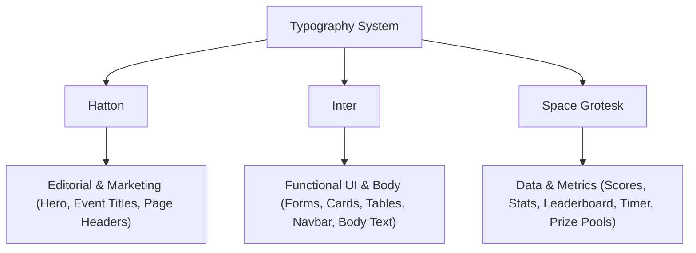

# Frontend Arena Design System (v1.0)
Welcome to the core visual identity and design system for **Frontend Arena**, a next-generation SaaS platform for hackathons, coding contests, AI competitions, and enterprise innovation challenges.

This document acts as the definitive source of truth for all designers, front-end engineers, and product managers building for the Frontend Arena ecosystem (Public Website, Participant Portal, Organizer Portal, Judge Portal, Admin Portal, Company Portal, College Portal, and Sponsor Portal).

---

## 1. Visual Language & Brand Guidelines

### Brand Personality
*   **Bold:** Confident in its position, making deliberate choices rather than passive ones.
*   **Premium & Luxury:** High-end SaaS styling drawing inspiration from Vercel, Linear, and Stripe. Large whitespace, high typography contrast, and elegant micro-interactions.
*   **Modern & Minimal:** Utilitarian layouts that emphasize user content and data without unnecessary decorative clutter or heavy neon-cyberpunk visual noise.
*   **Community-Driven:** Warm and inviting at the micro-level, combined with institutional reliability at the enterprise level.

### Visual Signature
Frontend Arena’s visual language is defined by the tension between two worlds: **classic editorial luxury** and **clinical developer utility**. This is achieved by combining a high-fashion editorial serif display font (Hatton) with a highly structured geometric number font (Space Grotesk) and an ultra-functional UI font (Inter), set against deep obsidian-black backdrops with high-contrast vibrant accents.

---

## 2. Color System

Frontend Arena is **Dark Theme First**. Light theme variants may be developed in the future for specific document exports or billing modules, but all core product interfaces operate in a luxurious dark mode space.

### Brand Accents
Our brand accents must be used sparingly—like a spotlight on a dark stage. They should represent no more than **5% to 8%** of the screen's active visual weight.
*   **Primary Accent:** `#FF006E` (Vibrant Pink/Rose) — Used for primary call-to-actions, active participant states, and high-priority brand indicators.
*   **Secondary Accent:** `#FFD60A` (Vibrant Yellow/Gold) — Used for winner badges, special event callouts, prize pool highlights, and critical emphasis.

### Semantic Color Scale

| Token Name | Hex Code | Description & Usage |
| :--- | :--- | :--- |
| **Background (Default)** | `#050505` | The canvas color. Deepest obsidian black. Used for viewport body. |
| **Surface (Primary)** | `#0D0D0E` | Default container background. Subtle grey-obsidian surface. |
| **Surface (Secondary)** | `#141416` | Lighter container surface for nested components, tables, and list items. |
| **Surface Hover** | `#1C1C1F` | Hover state for interactive cards, list items, and menu options. |
| **Surface Active** | `#252529` | Pressed or selected container state. |
| **Text Primary** | `#F5F5F7` | Core reading color. Off-white to reduce eye strain in high-contrast dark mode. |
| **Text Secondary** | `#A1A1AA` | Supporting copy, descriptions, subheaders, and metadata. |
| **Text Muted** | `#71717A` | Placeholder text, disabled inputs, and very low-priority metadata. |
| **Border Muted** | `#1E1E22` | Default subtle divider/border for default structure layout. |
| **Border Active** | `#3F3F46` | Border color for focused elements or selected states. |
| **Border Brand** | `#FF006E` | Accent border for highlighted interactive focus (e.g., active input). |
| **Divider** | `#161619` | Micro-separators inside tables, dropdowns, and cards. |

### Status Colors (Functional)

| Category | Token | Hex | Usage |
| :--- | :--- | :--- | :--- |
| **Success** | Text | `#10B981` | Positive actions, completed stages, passed test cases. |
| | Background | `#022C22` | Subtle container background for success badges. |
| | Border | `#064E3B` | Success card/badge border. |
| **Warning** | Text | `#F59E0B` | Time-sensitive warnings, draft submissions, pending status. |
| | Background | `#451A03` | Warning badge background. |
| | Border | `#78350F` | Warning badge border. |
| **Danger** | Text | `#EF4444` | High-risk actions, errors, failed builds, disqualified entries. |
| | Background | `#450A0A` | Danger/Error container background. |
| | Border | `#7F1D1D` | Danger container border. |
| **Info** | Text | `#3B82F6` | General non-blocking notifications, hints, and instructions. |
| | Background | `#172554` | Info container background. |
| | Border | `#1E3A8A` | Info container border. |

---

## 3. Typography

A strict typographic hierarchy governs Frontend Arena, dividing roles strictly by font family.



### 1. Brand Display Font: Hatton
*   **Classification:** Editorial Serif / Display
*   **Role:** Exclusively reserved for high-impact brand moments. It must **never** be used in body text, UI, tables, or navigation.
*   **Styling Rules:** Always style with slightly tighter letter-spacing and lowercase/sentence case. Avoid uppercase Hatton.

### 2. UI & Body Font: Inter
*   **Classification:** Neo-grotesque Sans-Serif
*   **Role:** The workhorse of the interface. Readability is paramount. Used for all inputs, buttons, menus, body blocks, labels, and table content.
*   **Styling Rules:** Utilize variable font features. Set `letter-spacing: -0.011em` for UI labels, and `-0.022em` for heavy headers.

### 3. Number Font: Space Grotesk
*   **Classification:** Geometric Sans-Serif / Monospaced-leaning
*   **Role:** Used only for numerical data, countdown timers, rankings, scores, analytics dashboards, and prize pools.
*   **Styling Rules:** Pair with tabular numbers styling. Space Grotesk has a tech-forward, high-precision aesthetic that immediately highlights metrics.

### Font Scale & Hierarchy Specification

| Hierarchy Role | Font Family | Weight | Size (px) | Line Height | Tracking (Letter Spacing) | Usage Example |
| :--- | :--- | :--- | :--- | :--- | :--- | :--- |
| **Display Hero** | Hatton | Medium | 72px | 1.1 | `-0.03em` | Landing Page Hero |
| **Display H1** | Hatton | Medium | 48px | 1.15 | `-0.02em` | Main Page Title |
| **Display H2** | Hatton | Medium | 32px | 1.2 | `-0.02em` | Section Titles (Marketing) |
| **UI H3** | Inter | Semi-Bold | 24px | 1.3 | `-0.022em` | Card Headers, Dialog Titles |
| **UI H4** | Inter | Semi-Bold | 18px | 1.4 | `-0.015em` | Table Headers, Small Subheads |
| **Body Large** | Inter | Regular | 16px | 1.6 | `-0.011em` | Introduction Text, Large Paragraphs |
| **Body Default** | Inter | Regular | 14px | 1.5 | `-0.011em` | Standard Body Copy, Label text |
| **UI Medium** | Inter | Medium | 13px | 1.4 | `-0.01em` | Form labels, Tab labels, Buttons |
| **UI Small** | Inter | Regular | 12px | 1.4 | `0` | Metadata, Breadcrumbs, Tooltips |
| **Number Giant** | Space Grotesk | Light/Medium | 96px | 1.0 | `-0.04em` | Countdown clock, main score |
| **Number Large** | Space Grotesk | Semi-Bold | 32px | 1.1 | `-0.02em` | Leaderboard ranks, Stats cards |
| **Number Default** | Space Grotesk | Medium | 14px | 1.2 | `0` | Table metrics, mini scores |

---

## 4. Spacing, Grid, & Layout Rules

Frontend Arena uses an 8px spatial grid to enforce consistent spacing across all pages. Layout margins and component paddings must always scale by values of 4, 8, 16, 24, 32, 48, 64, 96, and 128.

### Responsive Breakpoints

```
[Mobile] -------- [Tablet] -------- [Desktop] -------- [Wide Desktop]
  320px            768px             1280px              1600px+
(4 cols)          (8 cols)          (12 cols)           (12 cols max)
```

*   **Mobile (xs/sm):** `< 768px` | 16px grid margin | 16px gutter | 4 Columns
*   **Tablet (md):** `768px - 1279px` | 32px grid margin | 24px gutter | 8 Columns
*   **Desktop (lg):** `1280px - 1599px` | 64px grid margin | 32px gutter | 12 Columns (Max container width: 1200px)
*   **Wide Desktop (xl):** `≥ 1600px` | Centered layout | 32px gutter | 12 Columns (Max container width: 1440px)

### Border Radius Tokens
We utilize minimal rounded corners to convey precision and architecture.
*   **`radius-xs` (4px):** Form checkboxes, radio buttons, micro tag pills.
*   **`radius-sm` (6px):** Small badges, tag chips, buttons.
*   **`radius-md` (8px):** Input boxes, select menus, dropdown dropdown items, table rows.
*   **`radius-lg` (12px):** Default Card components, dialog modules, notification toasts.
*   **`radius-xl` (16px):** Main layout wrapper blocks, dashboard cards, modal frame components.

### Elevation, Shadows, & Blurs
In a dark theme, shadows do not create depth via pure black opacity. Instead, we use very soft ambient occlusion shadows combined with structural background highlights.
*   **Shadow Flat:** No shadow. Element defined purely by `#1E1E22` border.
*   **Shadow Low (Interactive State / Hover):** `0px 2px 8px rgba(0, 0, 0, 0.5), inset 0px 1px 0px rgba(255, 255, 255, 0.05)`
*   **Shadow Medium (Floating Card / Dropdown):** `0px 8px 24px rgba(0, 0, 0, 0.6), inset 0px 1px 0px rgba(255, 255, 255, 0.08)`
*   **Shadow High (Dialog / Toast):** `0px 20px 48px rgba(0, 0, 0, 0.8), inset 0px 1px 1px rgba(255, 255, 255, 0.1)`
*   **Glassmorphism (Subtle):** Backdrop blur `12px` | Background: `rgba(13, 13, 14, 0.7)` | Border: `rgba(255, 255, 255, 0.05)`

---

## 5. Icons Guidelines

To maintain visual alignment with our typography and spacing, icons must adhere to strict geometric rules.

*   **Icon Library Choice:** Lucide / Feather Icons.
*   **Icon Style:** Linear, geometric vector strokes. No solid/filled icons unless denoting an active state (e.g., filled star for bookmark).
*   **Stroke Width:**
    *   `1.5px` for standard UI states (default).
    *   `2.0px` for extra-small icons (12px or less) to improve readability.
*   **Sizing Scale:**
    *   `14px` — Mini (used inside badges, micro buttons, text-inline symbols).
    *   `18px` — Standard (used inside text inputs, standard buttons, sidebar links).
    *   `24px` — Large (used inside hero sections, large dashboards, empty state headers).
*   **Consistency Rules:**
    *   Never mix round icons and square-corner icons from different families.
    *   Icons must share the color of the adjacent text. If the text is text-secondary, the icon must inherit that style.

---

## 6. Component Specifications

### Buttons
All buttons feature standard `transition: all 0.2s cubic-bezier(0.16, 1, 0.3, 1)` and a height of `38px` (medium) or `46px` (large).

*   **Primary Button:**
    *   *Visuals:* Solid `#FF006E` background with `#F5F5F7` text. 1px solid transparent border.
    *   *Hover:* Background `#E20062`, slight elevation shadow.
    *   *Focus:* 2px offset border using `#FF006E`.
*   **Secondary Button:**
    *   *Visuals:* Solid `#141416` background with `#F5F5F7` text. 1px solid `#1E1E22` border.
    *   *Hover:* Background `#1C1C1F`, border changes to `#2E2E35`.
*   **Outline Button:**
    *   *Visuals:* Transparent background. 1px solid `#1E1E22` border. `#A1A1AA` text.
    *   *Hover:* Background `rgba(255, 255, 255, 0.03)`, text `#F5F5F7`, border `#2E2E35`.
*   **Ghost Button:**
    *   *Visuals:* Transparent background. No border. `#A1A1AA` text.
    *   *Hover:* Background `rgba(255, 255, 255, 0.04)`, text `#F5F5F7`.
*   **Danger Button:**
    *   *Visuals:* Solid `#EF4444` background (or transparent with red outline for secondary danger). `#F5F5F7` text.
    *   *Hover:* Background `#DC2626`.
*   **Icon Button:**
    *   *Visuals:* Typically ghost or outline, perfectly square (`38px x 38px`), containing only an 18px icon centered.

### Inputs & Controls

```
[ Label Text ]
+------------------------------------------+
|  [Icon]  Input Placeholder Text          |
+------------------------------------------+
```

*   **Text Inputs:**
    *   *Default:* Height `40px`. Background `#0D0D0E`. Border `1px solid #1E1E22`. Text `#F5F5F7`. Placeholder `#71717A`.
    *   *Focus:* Border `#FF006E` with a very soft ambient glow.
*   **Dropdown / Select Menu:**
    *   *Default:* Visual matches input box. Custom disclosure arrow on the right.
    *   *Overlay Menu:* Renders suspended over other elements. Background `#0D0D0E`, border `#1E1E22`, blur filter, Shadow Medium. Dropdown items have `radius-sm` and a subtle hover accent (`rgba(255, 0, 110, 0.08)` background with white text).
*   **Checkbox & Radio Button:**
    *   *Default:* Checkbox is square (`16px`), radio is circle (`16px`). Background `#0D0D0E`, border `#2E2E35`.
    *   *Checked:* Background `#FF006E`, border `#FF006E`.
*   **Switch (Toggle):**
    *   *Container:* Outer track `36px` width, `20px` height. Background `#1C1C1F`. Border `1px solid #2E2E35`. Rounded capsule shape.
    *   *Thump:* White circle `16px x 16px` with custom transition. Shift `16px` to the right when active.
    *   *Active State:* Track background `#FF006E`, border `#FF006E`.

### Cards
Cards are the fundamental unit of UI layout for hackathons and dashboards.

*   **Hackathon Card (Marketing & Catalog):**
    *   *Aesthetic:* Minimalist with dynamic glass hover. Height variable. Background `#0D0D0E` with a `1px solid #1E1E22` border.
    *   *Details:* Large Hatton display font for event title. Top tag denotes status (e.g., "Active" in emerald green). Bottom row features prize pool (Space Grotesk numbers) and days remaining (Space Grotesk).
    *   *Interaction:* On hover, the border transitions to a micro-gradient (fading from `#FF006E` to `#FFD60A`) and the card scales up slightly (`scale(1.01)`).
*   **Dashboard Card:**
    *   *Aesthetic:* Focused on layout utility. Outer border `#1E1E22`. Background `#0D0D0E`. Padding `24px` grid. Title is `UI H4` Inter. Text description secondary.
*   **Stat Card:**
    *   *Aesthetic:* Designed to highlight numbers.
    *   *Layout:* Large metric value in `Number Giant` or `Number Large` (Space Grotesk, `#F5F5F7` or brand colors) with secondary text labeling the metric directly below it. Small sparkline or delta badge (e.g., `+12.4%` in green) placed in the upper right.
*   **Leaderboard Card:**
    *   *Aesthetic:* High-contrast listing. Alternates row backgrounds between `#0D0D0E` and `#050505`.
    *   *Layout:* Rank number on left (Space Grotesk, gold for 1st, silver for 2nd, bronze for 3rd). Profile avatar in center with participant name (Inter). Final score on right (Space Grotesk, bright yellow `#FFD60A` or primary pink `#FF006E`).
*   **Profile Card:**
    *   *Aesthetic:* Premium showcase. Left alignment contains circular avatar with double border (`#0D0D0E` inside, `#FF006E` outside). Name is Inter bold, subtext contains developer badges (e.g., "React Elite", "Solidity").
*   **Certificate Card:**
    *   *Aesthetic:* A visual trophy. Uses subtle background gradients `linear-gradient(135deg, #0D0D0E 0%, #161619 100%)`. Border features a thin `#FFD60A` gold accent line. Elegant signature scripts, and official verification hash printed in monospace `Space Grotesk` at the bottom.

### Tables
Used for listings of participants, submissions, and metrics.
*   **Structure:** No vertical gridlines. Horizontal dividers only (`1px solid #161619`).
*   **Headers:** Uppercase Inter, `11px`, letter-spacing `0.05em`, color `#71717A`.
*   **Row Height:** `48px` to `56px` to maintain whitespace.
*   **Row Hover:** Row background transitions to `#141416` on hover.

### Navigation Elements
*   **Navbar:**
    *   *Visuals:* Fixed to top of viewport. Height `64px`. Background: Glassmorphic blur `16px` over `rgba(5, 5, 5, 0.8)`. Bottom border `1px solid #161619`.
    *   *Layout:* Brand logo on left, navigation links centered, call-to-actions on right.
*   **Sidebar:**
    *   *Visuals:* Width `240px` (or collapsed to `64px` icon-only). Background `#0D0D0E`, border right `1px solid #161619`.
    *   *Interactions:* Navigation links use Inter Medium (`13px`). Active state uses outline accent or left indicator strip (`#FF006E`), with active text color highlighting to white.
*   **Breadcrumb:**
    *   *Visuals:* Standard inline links. Separated by `/` or chevron. Text color `#71717A`, hover turns to `#F5F5F7`. Active item is always static and colored `#A1A1AA`.
*   **Tabs:**
    *   *Segmented Style (Pill):* Rounded track `#141416` with sliding active pill `#1C1C1F`. High-end feel.
    *   *Underline Style:* Minimalist. Tab labels sit on top of a thin divider line. Active tab has a bottom border highlight (`2px` solid `#FF006E`).

### Feedback & Process Indicators
*   **Timeline:**
    *   *Visuals:* Vertical `2px` line (`#1E1E22`). Active nodes feature a pulsing `#FF006E` ring. Completed nodes display a green success checkmark.
*   **Progress Bar:**
    *   *Track:* Height `6px`, background `#1C1C1F`, rounded corners.
    *   *Indicator:* Background `#FF006E` or gradient. Option for custom loading striping.
*   **Stepper:**
    *   *Visuals:* Sequential circular nodes (`24px x 24px`) displaying number (Space Grotesk). Steps are connected by progress bars. Active step gets border outline `#FF006E`.
*   **Calendar:**
    *   *Visuals:* Clean grid layout. Minimal dates. Current day gets a small accent dot below the number. Event deadlines are represented as horizontal color-coded bars across calendar days (matching info/warning/danger colors).

### Data Visualization & Charts
*   **Theme Integration:** Grid lines in charts must use `#161619`. Axis labels must be Inter, `10px` size, color `#71717A`.
*   **Visual Elements:** Area charts must use gradients fading to transparent: `linear-gradient(to bottom, rgba(255, 0, 110, 0.3) 0%, rgba(255, 0, 110, 0) 100%)`. Bar charts should have rounded top corners (`radius-xs`).

### States
*   **Empty State:**
    *   *Aesthetic:* Centered container, plenty of spacing. Icon (`24px`) in neutral-muted grey. Headline in `UI H3`. Subtext body `14px` detailing next steps. A single primary CTA button to start the action.
*   **Loading Skeleton:**
    *   *Visuals:* Flat rectangles mimicking the component outline. Background color `#141416`. Uses keyframe animation `shimmer` (sliding gradient highlighting from left to right) every 1.5 seconds.
*   **Error State:**
    *   *Visuals:* Card design with a crimson border `#7F1D1D` and light red background tint `#450A0A`. Includes error details in monospace text and action button to retry.

### Overlays & Toast
*   **Dialog / Modal:**
    *   *Visuals:* Centers on viewport. Requires backdrop overlay `rgba(0, 0, 0, 0.7)` with backdrop blur `8px`. Card radius `16px`, background `#0D0D0E`, border `1px solid #1E1E22`. Animation enters via scale transition (`0.95` to `1.0`).
*   **Tooltip:**
    *   *Visuals:* Tiny block. Background `#0D0D0E`, border `1px solid #1E1E22`. Text Inter UI Small (`12px`) color `#F5F5F7`. Instantly visible on hover (with a 300ms delay to avoid flashing UI).
*   **Toast Notification:**
    *   *Visuals:* Small notification popping up in the bottom-right corner. Background `#0D0D0E`, border `1px solid #1E1E22`, card radius `8px`. Slides in from the right. Left margin contains status icon (Success/Warning/Danger/Info).

---

## 7. Motion & Animation Guidelines

Animations in Frontend Arena are purposeful, functional, and fast. We avoid slow or bouncy animations, focusing instead on responsiveness and professional performance.

### Core Motion Curves
*   **Standard Easing (Decelerate):** `cubic-bezier(0.16, 1, 0.3, 1)` (Ultra-premium ease-out curve. Feels extremely responsive.)
*   **Accelerate (Exit):** `cubic-bezier(0.7, 0, 0.84, 0)` (Used when elements are leaving the viewport.)
*   **Standard Durations:**
    *   **Micro-interactions (Hover, button state transitions):** `150ms`
    *   **Expansion/Collapse (Sidebar, accordion, dropdown):** `250ms`
    *   **Page Transitions / Large Modals:** `350ms`

### Specific Component Animations
*   **Hover States:** Any hover elevation should transition with a subtle transform `translateY(-2px)` and box shadow expansion using the standard easing curve.
*   **Leaderboard Ranking Animation:** When ranks change, items use CSS Grid/Flex layout transitions to slide vertically into their new positions over `400ms`.
*   **Score Reveal (Countdown/Prize):** Number scores count up sequentially from `0` to target value, using the Space Grotesk font, triggered when the element becomes visible in the viewport.
*   **Toast Entry:** Slide in from right over `250ms`, opacity `0` to `1`. Exit fades down over `150ms`.

---

## 8. Accessibility (a11y) Guidelines

SaaS platforms must be accessible to all users. Frontend Arena builds accessibility directly into the design tokens.

*   **Contrast Standards:** Ensure all text-to-background contrast ratios meet **WCAG 2.1 AA** requirements. Text Primary (`#F5F5F7`) on Background (`#050505`) yields a contrast of `19.7:1` (exceeding AAA). Text Secondary (`#A1A1AA`) yields a ratio of `6.2:1`.
*   **Focus Ring Indicator:** Non-mouse navigation (keyboard tab navigation) must display a clear focus ring: outline style `2px` solid `#FF006E` with `4px` padding offset.
*   **Touch Targets:** Interactive targets (buttons, links, form inputs) on touch-based devices must maintain a minimum bounding box of `44px x 44px`.
*   **Screen Reader Labels:** Form elements must feature associated `<label>` structures or clear `aria-label` attributes.

---

## 9. Design System Do's and Don'ts

### Do's
*   **Do** rely heavily on empty space (whitespace). Let Hatton display headlines breathe.
*   **Do** restrict `#FF006E` and `#FFD60A` to accent points.
*   **Do** use Space Grotesk strictly for numerical/quantifiable metrics.
*   **Do** keep layout lines clean and geometric. Rely on border dividers rather than solid background color contrasts to separate regions.

### Don'ts
*   **Don't** use Hatton for dashboard text, forms, table content, or body paragraphs. It degrades readability at small sizes.
*   **Don't** apply neon-glow effects or hyper-saturated gradients across entire card backdrops. It damages the premium enterprise aesthetic.
*   **Don't** use pure solid blacks (`#000000`) for containers; always use the designated surfaces scale.
*   **Don't** mix multiple icon libraries. Always maintain Lucide/Feather linear geometric style.

---

## 10. Future Scalability

As Frontend Arena expands from a participant portal to multi-portal enterprise software, the design system scales through **themed sub-spaces**.

### Portal Theme Differentiation (Slight Accents)
Each portal inherits the exact same core system (obsidian backgrounds, Hatton typography, spacing rules) but is subtly colored via its secondary accent theme to give administrators, judges, and companies immediate spatial context:

*   **Participant Portal:** Accent theme relies on core Pink (`#FF006E`) — Represents action, energy, and delivery.
*   **Organizer / Admin Portal:** Accent theme shifts to Royal Blue (`#3B82F6`) — Represents control, management, and authority.
*   **Judge Portal:** Accent theme shifts to Gold/Amber (`#FFD60A`) — Represents evaluation, quality, and reward.
*   **Sponsor / Company Portal:** Accent theme shifts to Mint Emerald (`#10B981`) — Represents investment, ROI, and hiring.
