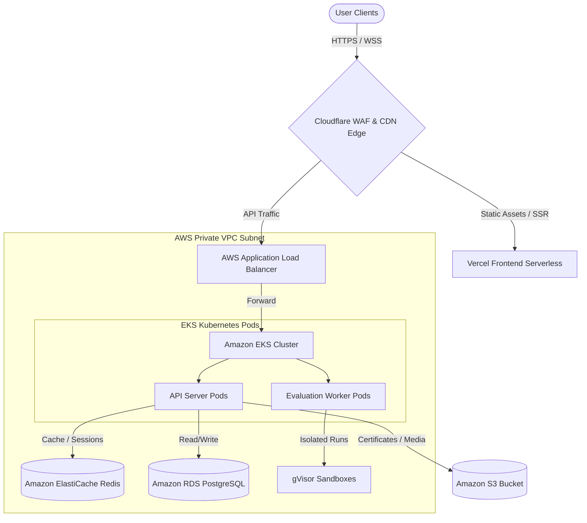
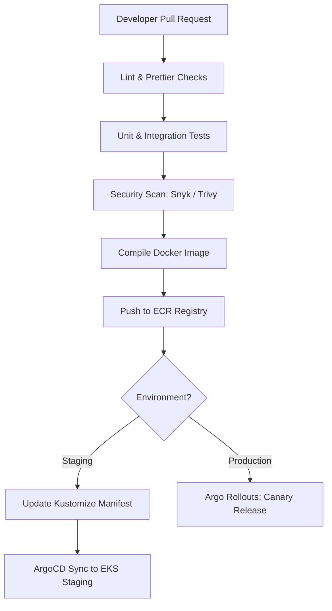

# Frontend Arena: DevOps & Cloud Operations Blueprint (v1.0)

This document is the official DevOps, Infrastructure, and Cloud Operations Blueprint for **Frontend Arena**. It outlines the cloud topology, container strategies, CI/CD pipelines, Kubernetes deployments, network structures, observability metrics, disaster recovery guidelines, and operations playbooks to manage platform uptime.

---

## Section 1: High-Level Cloud Infrastructure

### 1. Purpose
Establishes the platform's multi-region cloud topology, service networks, and data storage boundaries to ensure zero-downtime operations.

### 2. Recommended Architecture
The platform is deployed in a multi-zone configuration on AWS, utilizing Cloudflare for Edge Security and Vercel for Frontend hosting:

---

## Section 2: Cloud Provider hosting Strategy

### 1. Purpose
Defines the hosting infrastructure across different growth phases to optimize reliability and pricing.

### 2. Recommended Architecture

#### A. MVP Stage (Up to 10k users):
*   *Frontend:* Vercel (Next.js Serverless).
*   *Backend APIs:* Railway / Render (Docker containers).
*   *Database & Cache:* Supabase (Managed Postgres) + Upstash (Serverless Redis).
*   *Media:* Cloudflare R2 (Zero egress object storage).

#### B. Growth & Scale Stage (100k - 1M users):
*   *Frontend:* Vercel Enterprise.
*   *Backend & Workers:* AWS EKS (Kubernetes managed cluster).
*   *Database & Cache:* Amazon RDS PostgreSQL (Primary + 2 Read Replicas) + Amazon ElastiCache (Redis Cluster).
*   *Security & CDN:* Cloudflare Enterprise (WAF, DDoS Protection, CDN).

---

## Section 3: Environments & Deployment Pipeline

### 1. Purpose
Ensures developers can build, test, and release features securely without risking production outages.

### 2. Recommended Architecture
We configure five isolated environments:
1.  **Local Development:** Run via Docker Compose.
2.  **Preview Environments:** Spin up automatically for every GitHub PR, hosted on Vercel (for frontend) and ephemeral Railway instances (for backend).
3.  **Staging (Pre-production):** Replicates production data schemas and runs inside an isolated AWS VPC subnet.
4.  **Production:** The live platform serving active hackathons.
5.  **Sandbox:** A tenant testing environment for enterprise clients.

---

## Section 4: Docker & Containerization Strategy

*   **API Containers:** Base image: `node:20-alpine` / `golang:1.22-alpine` (multi-stage builds to minimize image sizes `< 100MB`).
*   **Worker Containers:** Configured with isolated runtimes (gVisor) and standard compilers (Node, Python, Go, Rust) pre-installed.
*   **Image Versioning:** Semantic versioning combined with git commit hashes (e.g., `api-server:v1.2.0-8a3d12f`). Images are stored in Amazon ECR.

---

## Section 5: CI/CD Pipeline (GitHub Actions Flow)

### 1. Purpose
Automates linting, testing, security vulnerability scanning, and Docker deployments.

### 2. Recommended Pipeline Flow

*   **Canary Deployment Strategy:** Argo Rollouts routes 10% of traffic to the new container version. If Prometheus detects no increase in `5xx` error rates over 15 minutes, traffic is gradually increased (25% -> 50% -> 100%).

---

## Section 6: Infrastructure as Code (IaC)

*   **Terraform:** Standardizes core cloud configurations (AWS VPC, RDS databases, EKS clusters, IAM roles, S3 buckets).
*   **Helm:** Packages Kubernetes manifests (`deployment.yaml`, `service.yaml`, `ingress.yaml`) to standardize deployments across environments.

---

## Section 7: Kubernetes Architecture (EKS Cluster Map)

*   **Namespaces:** Isolated namespaces split workloads: `core-apps`, `eval-workers`, `observability`, `security`.
*   **Horizontal Pod Autoscaler (HPA):** Scales pods based on target CPU metrics (`> 70%` utilization) or queue lag duration (`> 50` pending jobs).
*   **Persistent Volumes (PV):** Stateful components (like ClickHouse logs storage) utilize EBS/EFS volumes via AWS CSI drivers.

---

## Section 8: Networking & Security Groups

*   **Private Subnets:** Database RDS instances and ElastiCache Redis pods sit in isolated subnets, blocked from public internet routes.
*   **Ingress Routing:** AWS ALB Ingress controller receives traffic from Cloudflare Edge and forwards requests to target service pods based on path headers.

---

## Section 9: Secrets Management

*   **Vault Integration:** HashiCorp Vault manages environment credentials. External API keys (Stripe, Twilio, OpenAI) are mounted dynamically as Kubernetes secrets at pod startup.
*   **Rotation Schedule:** Database credentials and API tokens rotate automatically every 30 days.

---

## Section 10: Observability Spec (LGTM Stack)

*   **Logging:** Grafana Loki collects structured logs shipped by Promtail agents.
*   **Metrics:** Prometheus scrapes system performance, database loads, and worker queue lengths.
*   **Tracing:** Grafana Tempo tracks API requests through microservice boundaries.
*   **Error Monitoring:** Sentry tracks frontend and backend runtime errors.

---

## Section 11: Disaster Recovery (DR) Policy

*   **Backups:** Daily incremental snapshots of RDS databases, replicated to secondary AWS regions. WAL logs stream continuously to support point-in-time recovery.
*   **Recovery Targets:**
    *   *Recovery Point Objective (RPO):* `< 15 minutes`.
    *   *Recovery Time Objective (RTO):* `< 30 minutes` (utilizing automated Route53 active-passive DNS failover configurations).
*   **Failover Flow:** If the primary region goes offline, DNS records route traffic to the standby region, prompting databases to promote read replicas to primary write nodes.

---

## Section 12: Cost Optimization Scaling Matrix

| Stage | Target Users | Monthly Hosting Cost Estimate (USD) | Cost Optimization Strategy |
| :--- | :--- | :--- | :--- |
| **MVP** | Up to 10k | `$150 - $400 / mo` | Render/Railway, Supabase, shared databases. |
| **Growth**| Up to 100k | `$1,500 - $3,500 / mo` | Single-region AWS EKS, RDS scaling replicas. |
| **Scale** | Up to 1M | `$8,000 - $15,000 / mo` | Spot instances for workers, ClickHouse log compression. |
| **Enterprise**| 10M+ | Custom Pricing | Multi-region, reserved DB instances, Cloudflare caching. |
