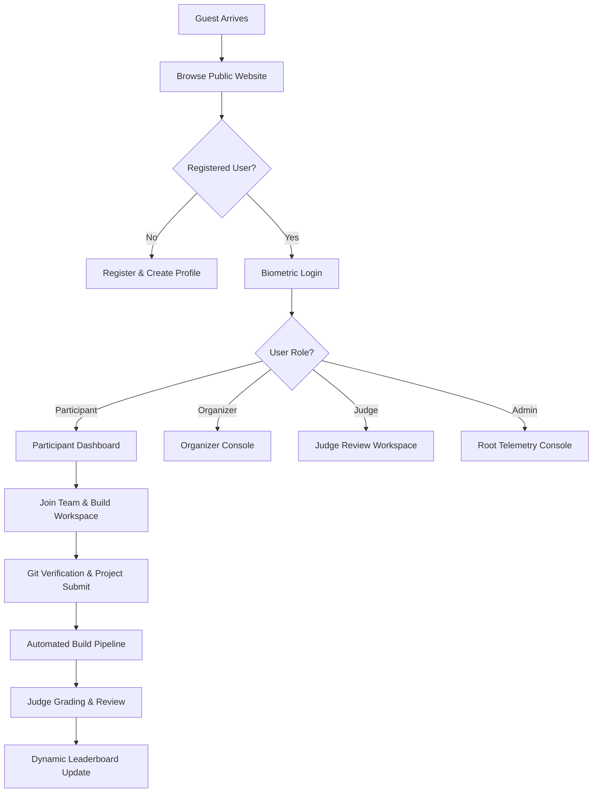

# Frontend Arena: Design QA & Engineering Handoff Document (v1.0)

This document serves as the official specification and production-ready handoff reference for developers building the Frontend Arena platform. It outlines design tokens, component APIs, layout rules, interactive flows, accessibility requirements, and QA checks, strictly adhering to the approved **Frontend Arena Design System**.

---

## Section 1: Design QA Review

Before writing code, the frontend team must verify that the codebase strictly enforces the following visual and structural rules:

*   **Pixel-Perfect Spacing:** All spacing must adhere to the 8px grid. There must be no arbitrary margins or paddings.
*   **Typography Isolation:** The Hatton display font is strictly reserved for marketing headlines and event titles. Ensure that Hatton is **never** compiled in dashboards, tables, forms, or navigation links.
*   **Contrast Standards:** Ensure that text and surface boundaries satisfy WCAG 2.1 AA requirements (contrast ratio exceeding `4.5:1` for regular text, and `3:1` for large text).
*   **Clean States:** Every interactive data container must include explicit states for:
    *   *Loading:* Shimmer skeletons matching the structural shape.
    *   *Empty:* Centered illustration, description copy, and a direct CTA.
    *   *Error:* Clean warning containers with retry buttons.

---

## Section 2: Design Tokens Catalog

### 1. Color Tokens (CSS Variables)

```css
:root {
  /* Brand Accents */
  --color-brand-primary: #FF006E; /* Pink */
  --color-brand-accent: #FFD60A;  /* Gold */

  /* Neutral Surface Ramp */
  --color-bg-default: #050505;
  --color-surface-primary: #0D0D0E;
  --color-surface-secondary: #141416;
  --color-surface-hover: #1C1C1F;
  --color-surface-active: #252529;

  /* Typography */
  --color-text-primary: #F5F5F7;
  --color-text-secondary: #A1A1AA;
  --color-text-muted: #71717A;

  /* Borders & Dividers */
  --color-border-muted: #1E1E22;
  --color-border-active: #3F3F46;
  --color-border-brand: #FF006E;
  --color-divider: #161619;

  /* Portal Sub-accents */
  --color-accent-organizer: #3B82F6;  /* Royal Blue */
  --color-accent-judge: #FFD60A;      /* Gold/Amber */
  --color-accent-mentor: #10B981;     /* Emerald Mint */
  --color-accent-admin: #6366F1;      /* Electric Indigo */
  --color-accent-company: #0D9488;    /* Teal */
  --color-accent-college: #8B5CF6;    /* Violet */
  --color-accent-recruiter: #64748B;  /* Slate Blue */
}
```

### 2. Spacing Scale

| Token | Value (px) | Usage Example |
| :--- | :--- | :--- |
| `spacing-xxs` | 4px | Checkbox padding, icon offset |
| `spacing-xs` | 8px | Button padding, text spacing |
| `spacing-sm` | 12px | Input inner padding, small cards |
| `spacing-md` | 16px | Container padding, list gaps |
| `spacing-lg` | 24px | Default card padding, grid margins |
| `spacing-xl` | 32px | Section gutters, page margins |
| `spacing-xxl` | 48px | Dashboard widget gaps, hero offsets |
| `spacing-3xl` | 64px | Page header padding, landing sections |

### 3. Typography Rules

*   **Display Font:** `font-family: 'Hatton', serif;`
*   **UI Font:** `font-family: 'Inter', -apple-system, BlinkMacSystemFont, sans-serif;`
*   **Data Font:** `font-family: 'Space Grotesk', monospace;`

### 4. Layout & Responsive Tokens
*   **Container Max Widths:**
    *   *Desktop Landing:* `1200px`
    *   *Wide Desktop:* `1440px`
    *   *Dashboard Content:* `1600px` (fluid with margins)
*   **Breakpoints:**
    *   `Mobile (sm)`: `< 768px`
    *   `Tablet (md)`: `768px - 1279px`
    *   `Desktop (lg)`: `1280px - 1599px`
    *   `Wide (xl)`: `≥ 1600px`

### 5. Elevation, Radii, & Z-Indices
*   **Radii:** `radius-xs` (4px), `radius-sm` (6px), `radius-md` (8px), `radius-lg` (12px), `radius-xl` (16px).
*   **Shadows:** Low Shadow, Medium Shadow, High Shadow (matching Section 4 of the Design System).
*   **Z-Index Layers:**
    *   `z-default`: `0`
    *   `z-sticky`: `100` (Headers, tab bars)
    *   `z-popover`: `200` (Dropdowns, tooltips)
    *   `z-modal`: `500` (Dialog overlays, command palette)
    *   `z-toast`: `1000` (Global alerts)

---

## Section 3: Component Library API

Developers must build components as reusable modules. Below are the functional specifications for the core library components:

### 1. Button Component (`<Button />`)
*   **Variants:** `primary` | `secondary` | `outline` | `ghost` | `danger` | `icon`.
*   **Sizes:** `sm` (32px height) | `md` (38px height) | `lg` (46px height).
*   **States:** `default` | `hover` | `focus` | `active` | `disabled` | `loading`.
*   **a11y:** Focus rings must trigger on tab focus (`outline: 2px solid var(--color-brand-primary)`). Disabled state must set `aria-disabled="true"`.

### 2. Input Component (`<Input />`)
*   **Variants:** `text` | `email` | `password` | `search` | `number` | `textarea`.
*   **States:** `default` | `hover` | `focus` (border variables change to active accent) | `error` (border color: `--color-danger`).
*   **a11y:** Associated `<label>` tag required, or clear `aria-label` tags.

### 3. Data Table Component (`<Table />`)
*   **Columns:** Explicit sorting hooks, text alignment variables (left for labels, right for data numbers).
*   **Density:** Paddings scale to compact (`8px`) for admin/telemetry dashboards, default (`16px`) for participant views.

---

## Section 4: Portal Page Inventory

| Portal | Page Name | Purpose | Key Components Used | Dependencies |
| :--- | :--- | :--- | :--- | :--- |
| **Public** | Home | Landing gate and CTA router | `<Button>`, `<Card>`, `<Navbar>` | None |
| | Explore | Discover events and hackathons | `<Input>`, `<Select>`, `<HackathonCard>` | Search APIs |
| | Event Details | Main registration landing page | `<Timeline>`, `<Accordion>`, `<StickyPanel>` | Auth state |
| **Participant**| Dashboard | Overview of milestones and stats | `<WelcomeBanner>`, `<ProgressBar>`, `<Timeline>`| Team APIs |
| | Team Space | Coordinate project tasks and chat | `<KanbanBoard>`, `<Input>`, `<ChatBox>` | WebSocket |
| | Submission | Upload code and verify build | `<Input>`, `<DragDropUpload>`, `<Terminal>` | Git APIs |
| | Evaluation | Audit scores and view reports | `<RadarChart>`, `<ScoreCard>`, `<Button>` | Engine APIs |
| **Organizer**  | Console | High-density control dashboard | `<Table>`, `<ChartContainer>`, `<Alert>` | Admin APIs |
| | Create Wizard | 10-step wizard configuration | `<WizardStepper>`, `<Input>`, `<RubricConfig>` | Event DB |
| **Judge** | Workspace | Distraction-free grading screen | `<SplitPane>`, `<IframeViewport>`, `<Scorecard>`| Dev URLs |
| **Admin** | Telemetry | Infrastructure monitor control room| `<WorkerCard>`, `<Terminal>`, `<AlertsGrid>` | Telemetry |

---

## Section 5: Portal User Flows

The following flow chart details the path mapping across different portals:



---

## Section 6: Navigation Maps

### 1. Desktop Layout Navigation
*   **Header Navigation:** Explore (Mega Menu) -> Enterprise -> Pricing -> Login -> CTA ("Host Event").
*   **Portal Navigation (Sidebar):** Stack list routing links to portal-specific sub-pages (Dashboard, Settings, Help).

### 2. Mobile Layout Navigation
*   **Tab Bar Dock:** Home (Tab 1) -> Explore (Tab 2) -> Team Workspace (Tab 3) -> Submission (Tab 4) -> Profile/More (Tab 5).

---

## Section 7: Inter-Component Prototype Links

*   **Public Landing Event Card:** Click -> Smooth transition (fade-out card to detail layout) -> loads **Event Details** page.
*   **Register Button (Details):** Click -> launches registration drawer (slides up from bottom on mobile, right edge overlay on desktop).
*   **Final Submit (Submission):** Click -> displays confirmation prompt ("Type project title to confirm lock") -> locks Git repository edit fields on confirm.

---

## Section 8: Responsive Grid Specifications

```
Grid Layout Columns
[Mobile (320px+)] --- 4 columns, 16px margins, 16px gutter
[Tablet (768px+)] --- 8 columns, 32px margins, 24px gutter
[Desktop (1280px+)] - 12 columns, 64px margins, 32px gutter (max: 1200px)
[Wide (1600px+)] ---- 12 columns, 32px gutter, centered container (max: 1440px)
```

*   **Breakpoint Actions:**
    *   *Main sidebars* collapse to icon-only at `< 1280px` and hide at `< 768px`.
    *   *Grid Lists* scale from 3 columns (desktop) to 2 columns (tablet) and 1 column (mobile).

---

## Section 9: Accessibility (a11y) Requirements

*   **Keyboard Focus Loops:** Users must be able to navigate all inputs, links, buttons, and tab segment selections using the `Tab` and `Shift+Tab` keys. Ensure focus loops remain locked inside modal drawers when open.
*   **ARIA Labels:** Interactive metrics, progress bars, and icon-only buttons must contain descriptive `aria-label` tags.
*   **Touch Targets:** Interactive targets (buttons, links, form inputs) on touch-based devices must maintain a minimum bounding box of `44px x 44px`.

---

## Section 10: Animation & Motion Spec

*   **Transitions Easing:** Utilize standard easing `--easing-standard: cubic-bezier(0.16, 1, 0.3, 1);` for all transitions.
*   **Durations:**
    *   *Micro-interactions:* `150ms` (hover, clicks).
    *   *Expand/Collapse:* `250ms` (accordions, sidebar toggles).
    *   *Page transitions:* `350ms` (modal entry, page splits).

---

## Section 11: Developer Handover & Structure

### 1. Proposed Code Folder Structure

```
frontend-arena/
├── public/                 # Static assets, branding logos
└── src/
    ├── assets/             # Global SVGs, Lottie JSON files
    ├── components/         # Reusable design system library
    │   ├── ui/             # Buttons, Inputs, Tables, Badges
    │   ├── cards/          # HackathonCard, StatCard, LeaderboardCard
    │   └── navigation/     # Sidebar, Header, MobileTabBar
    ├── styles/
    │   ├── variables.css   # Core CSS Design tokens
    │   └── global.css      # Baseline CSS styles
    ├── portals/            # Portal workspaces views
    │   ├── participant/    # Developer dashboard and submission views
    │   ├── organizer/      # Event creation and registration manager
    │   └── admin/          # Infrastructure telemetry consoles
    └── utils/              # Help helpers (APIs, formatting data)
```

### 2. Component Naming Conventions
*   **Files:** PascalCase (e.g., `HackathonCard.tsx`, `PrimaryButton.tsx`).
*   **Styling selectors:** BEM or CSS Modules (e.g., `.button--primary`, `.table__row--active`).

---

## Section 12: Production Readiness Quality Checklist

- [ ] **Design QA:** Every screen verified against Hatton/Inter typography rules.
- [ ] **Spacing Compliance:** Zero margins/paddings deviate from the 8px grid.
- [ ] **Contrast Verification:** Global styles satisfy WCAG AA contrast criteria.
- [ ] **State Coverage:** Skeletons, empty states, and errors verified for every view.
- [ ] **Responsive Check:** Forms, tables, and dashboards scale cleanly to mobile.
- [ ] **Keyboard Nav Check:** Tab index cycles in order, and focus loops lock inside active modals.
- [ ] **Motion Check:** Transitions use `cubic-bezier(0.16, 1, 0.3, 1)` easing.

---

## Section 13: Future Design Roadmap

### Phase 2: Version 2 Features
*   **Web3 credentials Integration:** Direct verification of developer wallets and achievements.
*   **AI Auto-Moderator Panel:** Automated code scans that highlight similarity ratios inside the Admin Moderation console.

### Phase 3: Version 3 Features
*   **Live Broadcast Video Studio:** Allows organizers to run video announcements and presentations directly inside the platform.
