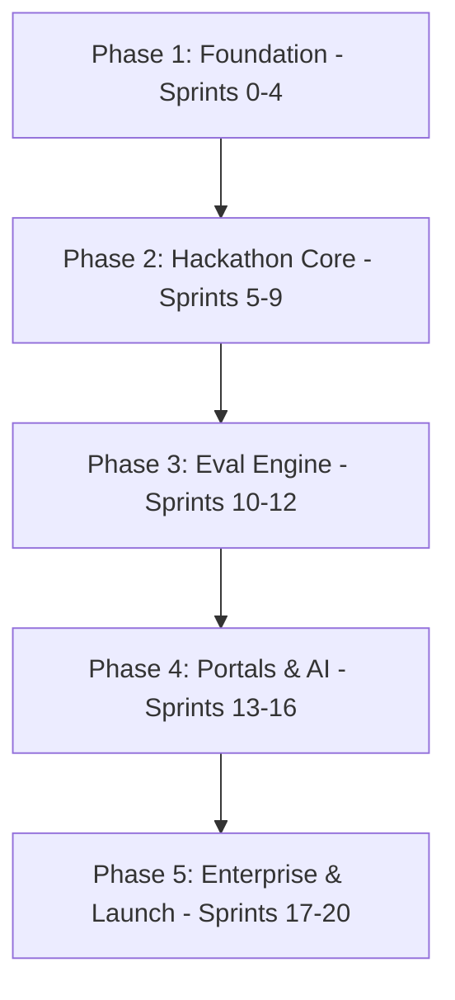
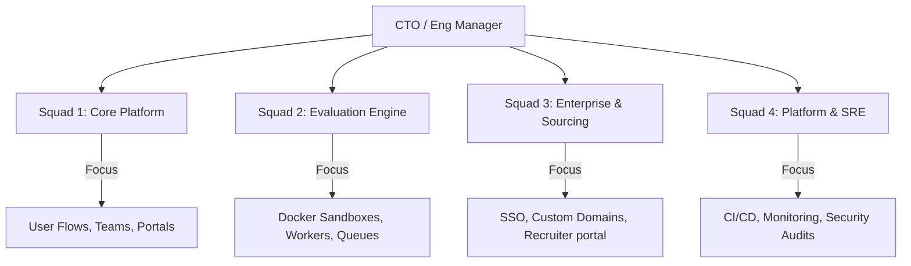

# Frontend Arena: Engineering Execution Masterplan (v1.0)

This document is the official Engineering Execution Masterplan and Development Roadmap for **Frontend Arena**. It defines the sprint schedules, team structures, task breakdowns, testing strategies, release milestones, and governance frameworks to guide a team of 20–50 software engineers from repository creation to global enterprise launch.

---

## Section 1: Product Development Strategy

### 1. Purpose
Establishes the engineering philosophy, development priorities, and release cadences to align software delivery with business objectives.

### 2. Goals
*   Minimize time-to-market for the core MVP loop.
*   Enforce architectural modularity to prevent early technical debt.
*   Maximize test automation from the start.

### 3. Deliverables
*   Established coding standards and CI/CD validation checks.
*   Buy vs. Build decision matrices for third-party integrations (e.g., Auth0 vs. custom Auth, AWS vs. Supabase).

### 4. Dependencies
*   Approval of visual identity and database blueprints (Completed in previous phases).

### 5. Team Ownership
*   **CTO & Engineering Manager:** Own product strategy, resource allocation, and architecture validation.

### 6. Timeline
*   Continuous baseline review during Phase 1 (Sprints 0–4).

### 7. Risks
*   *Risk:* Scope creep delaying the core MVP loop.
*   *Mitigation:* Enforce strict feature freeze policies for Phase 1.

### 8. Success Criteria
*   Automated CI checks run in under 5 minutes.
*   Design system components achieve 100% reuse across initial views.

### 9. Future Improvements
Evaluate edge-computing engines (e.g., Cloudflare Workers) to move static rendering checks closer to local clients.

---

## Section 2: Product Development Phases

### 1. Purpose
Divides product development into major sequential delivery blocks to ensure gradual validation.

### 2. Recommended Phases



*   **Phase 1: Platform Foundation (Sprints 0–4):** Setup repositories, establish CI/CD pipelines, configure Auth pipelines, and finalize core user profile models.
*   **Phase 2: Core Hackathon Platform (Sprints 5–9):** Build team workspaces, registration flows, and basic project submission forms.
*   **Phase 3: Evaluation Engine (Sprints 10–12):** Build gVisor-based sandbox runners, compile verification pipelines, and configure leaderboard caching.
*   **Phase 4: Portals & AI (Sprints 13–16):** Finalize Judge, Mentor, and Admin interfaces, and integrate AI review tools.
*   **Phase 5: Enterprise & Launch (Sprints 17–20):** Implement White-Label configurations, SAML SSO integrations, run security audits, and launch.

---

## Section 3: Sprint Planning (Sprints 0–20)

Each sprint has a duration of **2 weeks**.

```
Sprint 0: Setup ──> Sprint 1-4: Auth & Orgs ──> Sprint 5-9: Core Loop ──> Sprint 10-12: Eval Engine
                                                                                     │
Launch <── Sprint 18-20: Security & QA <── Sprint 17: Enterprise <── Sprint 13-16: Portals & AI
```

### 1. Sprint 0: Project Setup
*   *Objectives:* Initialize repositories, configure monorepo workspaces, and set up staging environments.
*   *Tasks:* Set up NestJS and Next.js templates, configure Docker Compose local stacks, and set up GitHub Actions CI pipelines.
*   *Definition of Done (DoD):* Monorepo compiles on local machines and Docker containers run via single commands.

### 2. Sprint 1 & 2: Authentication & Organizations
*   *Objectives:* Implement JWT token flows, session handlers, and tenant metadata profiles.
*   *Tasks:* Build Auth endpoints, configure PostgreSQL schemas, and write basic input validators.

### 3. Sprint 5 & 6: Teams & Submissions
*   *Objectives:* Create team workspaces, invite flows, and git sync endpoints.
*   *Tasks:* Create team invitation tokens and write Git webhook routing hooks.

### 4. Sprint 7 & 8: Sandbox Evaluation & Leaderboards
*   *Objectives:* Run isolated Docker sandboxes and recalculate leaderboard rankings.
*   *Tasks:* Configure gVisor runtimes, build test execution suites, and setup Redis Sorted Sets.

### 5. Sprint 11 & 12: Judge & Mentor Portals
*   *Objectives:* Build the split-pane Evaluation Workspace for judges and booking calendars for mentors.

### 6. Sprint 17: Enterprise & White-Labeling
*   *Objectives:* Support custom domain configurations and SAML SSO connections.

### 7. Sprint 19 & 20: Performance, Security, & Launch
*   *Objectives:* Run load tests, fix security issues, and launch the platform.

---

## Section 4: Engineering Team Structure

To execute the masterplan, the engineering team is organized into four cross-functional squads:



---

## Section 5: Database Migration & Rollback Strategy

*   **Migration Engine:** Prisma Migrations (Development) / dbmate (Production deployments).
*   **Rollback Strategy:** Every schema change must include a corresponding rollback script (`down.sql`).
*   **Zero-Downtime Rule:** Migrations must be backwards-compatible (expand-and-contract pattern). Schema updates (like column renames) are executed in two steps to prevent active API server crashes during deployments.

---

## Section 6: Testing Strategy & DORA KPIs

```
Unit Tests (80% Cov) ──> Integration Tests ──> API & E2E (Playwright) ──> Load Tests (k6)
```

*   **Unit & Integration Tests:** Run automatically on every push. Enforce a minimum **80% code coverage** threshold for build approval.
*   **Load Testing (k6):** Runs simulated load scenarios on staging prior to release gates, verifying that API latency remains `< 200ms` at 5,000 requests/second.

---

## Section 7: Risk Management Matrix

| Identified Risk | Impact / Severity | Mitigation Strategy |
| :--- | :--- | :--- |
| **Sandbox Jailbreak** | Critical / High | Run container runtimes under gVisor namespaces. Restrict network access and apply CPU limits. |
| **Leaderboard Write Spike**| High / Medium | Cache rankings in Redis Sorted Sets, batching database updates. |
| **SAML Config Failures** | Medium / Medium | Provide a step-by-step SSO self-service checker to validate XML metadata before applying changes. |
