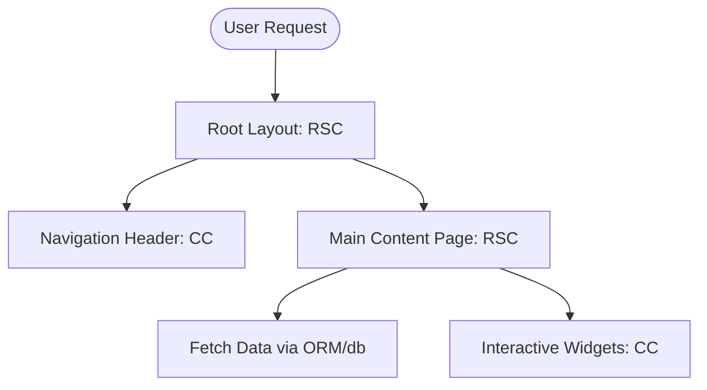

# Frontend Arena: Frontend Engineering Blueprint (v1.0)

This document is the official Frontend Engineering Blueprint for **Frontend Arena**. It defines the Next.js App Router patterns, directory structures, state management rules, API integration caches, responsive strategy, and accessibility policies for the frontend engineering team.

---

## Section 1: Frontend Architecture & Layout

### 1. Purpose
Establishes the rendering paradigms, loading boundaries, and routing hierarchies to ensure fast page load speeds and consistent layout rendering.

### 2. Recommended Architecture
The frontend uses the **Next.js App Router** with a strict hybrid rendering strategy:
*   **React Server Components (RSC):** Default for all pages, layouts, and data fetch layers. Reduces client-side bundle size.
*   **Client Components (CC):** Strictly isolated for interactive features (e.g., forms, dropdowns, code sandboxes) using `'use client'` directives.
*   **Server Actions:** Used for mutations (form submissions, status updates) to bypass REST endpoint boilerplate.



### 3. Folder Structure
*   `app/(marketing)/` — Public landing pages (SSR/ISR).
*   `app/(auth)/` — Auth forms (CSR).
*   `app/(dashboard)/` — Participant, Organizer, and Admin portals.
*   `app/error.tsx` & `app/loading.tsx` — Standard boundaries.

---

## Section 2: Project Folder Directories

### 1. Purpose
Standardizes code placement across the monorepo to ensure scalability as features are added.

### 2. Recommended Architecture

```
frontend-arena-web/
├── app/                        # Next.js App Router (pages & layouts)
├── components/                 # Shared design system components (base UI)
│   └── ui/                     # shadcn/ui primitives
├── features/                   # Domain-driven features (colocated code)
│   ├── authentication/
│   ├── dashboard-participant/
│   └── submission-center/
│       ├── components/
│       ├── hooks/
│       ├── services/
│       └── store.ts
├── hooks/                      # Global reusable hooks
├── lib/                        # Third-party integrations client config (e.g., Stripe)
├── providers/                  # React Context providers (Theme, Auth, QueryClient)
├── styles/                     # global.css, Tailwind configurations
└── utils/                      # Helper libraries (date formatters, text parsers)
```

---

## Section 3: Feature-Based colocation

### 1. Purpose
Organizes code by business domain (e.g., `submissions`, `leaderboards`) rather than technical type, making it easier to maintain and scale.

### 2. Colocation Rules
Every directory inside `features/` must be self-contained:
*   `components/`: Colocated UI components unique to the feature.
*   `hooks/`: Reusable hooks managing feature-specific state or timers.
*   `services/`: Fetch wrappers and mutations unique to the feature.

---

## Section 4: Routing & Middleware

### 1. Purpose
Manages path traversal limits, auth validation checks, and role-based access control redirect rules.

### 2. Recommended Architecture
*   **Middleware Protection:** Next.js `middleware.ts` intercepts requests, parses session JWTs, and checks scopes:
    *   `/portal/participant/*` -> Requires `PARTICIPANT` role.
    *   `/portal/organizer/*` -> Requires `ORGANIZER` role.
    *   `/portal/admin/*` -> Requires `PLATFORM_ADMIN` role.

---

## Section 5: Component Architecture Hierarchy

*   **Base Components (shadcn/ui):** Atom-level UI primitives (Buttons, Inputs, Dialogs) located in `components/ui/`.
*   **Shared Components:** Reusable wrappers (Navbar, Sidebar, Footer) located in `components/`.
*   **Feature Components:** colocated feature widgets (e.g., `TeamList`, `SubmissionCard`) located in `features/{name}/components/`.
*   **Page Components:** Entry points located inside App Router files.

---

## Section 6: State Management Strategy

To optimize rendering speeds, data is categorized and managed in specific stores:

```
  Data Type           State Manager             Caching Policy
  ────────────────────────────────────────────────────────────────
  Server State   ───> TanStack Query      ───> Query Cache (Stale)
  Global State   ───> Zustand             ───> Local Session Cache
  Form State     ───> React Hook Form     ───> Local Component State
```

*   **Zustand:** Global UI state (sidebar open state, user settings, active theme).
*   **TanStack Query (React Query):** Server state caching, background queries, refetches, and optimistic UI updates.
*   **React Hook Form + Zod:** Form input validation.

---

## Section 7: API Client Integration

*   **HTTP Client:** Axios instance (or `fetch` wrapper) configured with interceptors:
    *   *Request Interceptor:* Automatically injects the bearer JWT into the `Authorization` header.
    *   *Response Interceptor:* Intercepts `401 Unauthorized` errors, pauses the request queue, refreshes the access token, and retries the failed requests.

---

## Section 8: Design System & shadcn/ui Implementation

*   **Atom mapping:** We map design system tokens to Tailwind utility classes.
*   **Interactive Components:** Modals, Drawers, and Select boxes utilize Radix UI primitives (styled with shadcn/ui defaults) to guarantee keyboard accessibility.

---

## Section 9: Responsive Framework & Animations

### 1. Breakpoints
*   Tailwind responsive prefixes enforce mobile-first styles: `sm: (768px)`, `md: (1024px)`, `lg: (1280px)`.

### 2. Animation Engine (Framer Motion)
*   Micro-animations utilize GPU-accelerated variants.
*   Enforce accessibility: Wrap animations with the `useReducedMotion` hook to bypass transitions if the user has enabled reduced motion preferences.

---

## Section 10: Performance Optimization

*   **Images:** Rendered via Next.js `<Image />` component to automatically resize assets, serve WebP formats, and lazy-load offscreen images.
*   **Code Splitting:** Dynamic imports (`next/dynamic`) lazy-load heavy components (e.g., the Code Playground sandbox or charts dashboards) only when they enter the viewport.

---

## Section 11: Security & Compliance Checklist

*   **XSS Mitigation:** Enforce strict Content Security Policy (CSP) headers. Never use `dangerouslySetInnerHTML` unless input is validated and sanitized using DOMPurify.
*   **Access Tokens:** Access tokens are stored only in memory. Refresh tokens are stored in secure, `HttpOnly`, `SameSite=Strict` cookies.
*   **CSRF Prevention:** Verify token headers and origin sources for all Server Actions.
