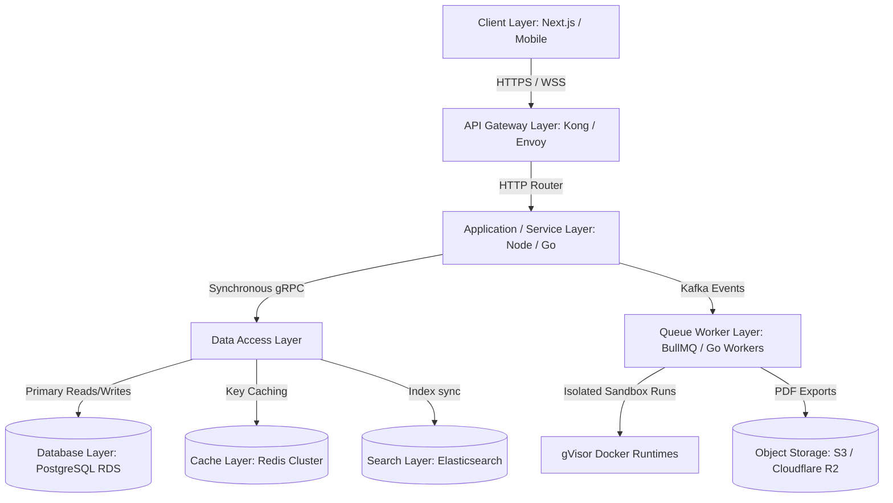
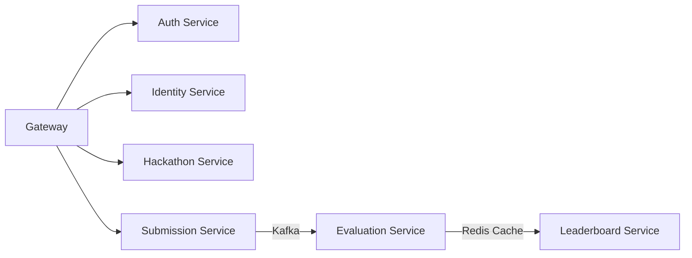
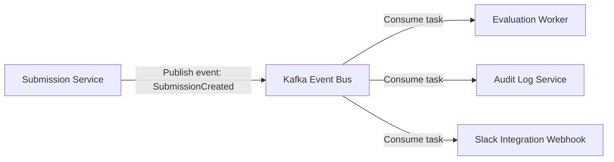

# Frontend Arena: System Architecture Blueprint (v1.0)

This document is the official Technical System Architecture Blueprint for **Frontend Arena**. It provides a comprehensive engineering reference for developers, DevOps engineers, and security teams, outlining the system's infrastructure, communication layers, and execution boundaries.

---

## Section 1: High-Level Architecture & Data Flow

### 1. Purpose
Defines the client-to-data-store layers and establishes the path traversal metrics for end-to-end data lifecycle operations.

### 2. Recommended Architecture
Frontend Arena uses a layered modular monolith/microservices architecture. The system is split into logical zones:



#### Client to Database Data Flow Lifecycle:
1.  **Request Initiation:** A participant uploads code. The client sends a `POST /api/v1/submissions` request with payload parameters (e.g., GitHub URL).
2.  **Gateway Routing:** The Gateway terminates TLS, runs rate-limiting checks, and routes the request to the Submission Service.
3.  **Authentication Handshake:** The Gateway validates the bearer JWT against the Auth Service cache.
4.  **Transaction Processing:** The Submission Service records the submission metadata in PostgreSQL (`Status: PENDING`) and broadcasts a `SubmissionCreated` event to Kafka.
5.  **Asynchronous Execution:** The Evaluation Worker consumes the event, invokes an isolated gVisor Docker runtime to build and test the code, and streams progress updates back to the client via WebSockets.
6.  **Persistence:** Post-evaluation, scores are saved in PostgreSQL, the leaderboard cache in Redis is recalculated, and ClickHouse stores the build logs.

### 3. Technical Reasoning
Separating the ingest layer (Gateway) from synchronous request handlers and intensive background workers ensures that spike workloads (e.g., last-minute hackathon submissions) do not degrade core dashboard API performance.

### 4. Alternatives Considered
*   *Alternative:* Direct client access to microservices.
*   *Rejection:* Exposes service ports directly, increasing security risks and requiring client-side service discovery.

### 5. Trade-offs
*   *Con:* Increased latency (approx. `1-2ms` overhead) due to gateway hops and service proxying.
*   *Pro:* High security, centralized logging, and uniform rate-limiting.

### 6. Scalability Strategy
The Gateway and Application services scale horizontally using Kubernetes HPA based on CPU/Memory thresholds. Data stores scale through read replicas and write-ahead logs partitioning.

### 7. Security Considerations
*   Configure TLS 1.3 only at the Gateway.
*   Isolate the data layer within a private VPC subnet.

### 8. Future Evolution
Transition the Gateway routing layer to edge worker functions (e.g., Cloudflare Workers) to handle geo-routing and token validation closer to users.

---

## Section 2: Domain-Driven Design (DDD)

### 1. Purpose
Establishes bounded contexts to define service ownership and prevent cross-domain database contamination.

### 2. Recommended Architecture
The platform is split into 16 bounded contexts, each with its own domain logic and datastore:

| Bounded Context | Responsibilities | Core Entities | Database Ownership |
| :--- | :--- | :--- | :--- |
| **Authentication** | OAuth, MFA, login flows, and token validation. | `UserSession`, `Credential` | `auth_db` |
| **Identity** | User profiles, skill tags, and developer portofolios. | `Profile`, `Badge`, `XPRecord` | `user_db` |
| **Organizations** | Tenants, custom domains, and corporate branding config. | `Tenant`, `BrandingConfig` | `org_db` |
| **Hackathons** | Event timelines, tracks, and registration rules. | `Event`, `Track`, `Timeline` | `hackathon_db` |
| **Teams** | Team formations, merge flows, and invitations. | `Team`, `Invitation` | `team_db` |
| **Participants** | Student verify profiles and registrations list. | `Registration` | `registration_db` |
| **Submissions** | Git sync endpoints, code metadata, and tags. | `Submission`, `CommitLog` | `submission_db` |
| **Evaluation** | Sandbox test parameters and rubric configurations. | `Rubric`, `EvaluationLog` | `evaluation_db` |
| **Leaderboards** | Event rankings and tie-breaker parameters. | `RankingCache` | Redis Cache Store |
| **Notifications** | Email/SMS template building and delivery records. | `Template`, `NotificationLog`| `notification_db`|
| **Certificates** | Cryptographic credentials templates and hashes. | `Certificate`, `VerifyHash` | `certificate_db` |
| **Recruitment** | Candidate sourcing profiles and pipelines. | `Shortlist`, `SourcingPipeline`| `recruitment_db` |
| **Billing** | SaaS subscriptions, invoicing, and usage limits. | `Subscription`, `License` | `billing_db` |
| **Analytics** | Raw telemetry records and analytics reports. | `SystemMetric`, `EventLog` | ClickHouse Storage |
| **AI Domain** | Code reviews and plagiarism analysis tasks. | `PlagiarismReport` | Object Store / DB |
| **Administration** | Maintenance switches and platform settings. | `FeatureFlag`, `AuditTrail` | `admin_db` |

### 3. Technical Reasoning
Enforces modular boundaries, enabling the engineering team to scale, refactor, or rewrite individual domains without risking side-effects in other services.

### 4. Alternatives Considered
*   *Alternative:* Shared database (monolith schema).
*   *Rejection:* Leads to tight coupling, making schema migration difficult and creating single points of database failure.

### 5. Trade-offs
*   *Con:* Eventual consistency challenges. Queries joining data across contexts (e.g., displaying username in a leaderboard list) require network hops or data replication.
*   *Pro:* Decoupled deployments and isolated database scaling.

### 6. Scalability Strategy
High-load databases (e.g., `submission_db`, `evaluation_db`) can be moved to dedicated high-performance hardware clusters independently of others.

### 7. Security Considerations
*   Restrict inter-domain data access to authenticated gRPC channels.
*   Prohibit direct cross-domain SQL joins.

### 8. Future Evolution
As team sizes grow, individual domains can transition into independent repository microservices with distinct hosting budgets.

---

## Section 3: Application Architecture (Modular Monolith vs. Microservices)

### 1. Purpose
Determines the repository and deployment structure to optimize developer velocity and system performance.

### 2. Recommended Architecture
Frontend Arena adopts a **Modular Monolith** pattern for MVP and Version 1.0, with a clear path to extract high-load execution domains (Evaluation, Notifications) into independent microservices.

```
frontend-arena-monorepo/
├── apps/
│   ├── api-gateway/
│   ├── web-marketing/
│   └── portal-dashboard/
└── packages/
    ├── domain-auth/
    ├── domain-evaluation/ (Designed for extraction)
    └── shared-types/
```

*   **Structure:** Single codebase containing isolated packages communicating via in-process event buses or local imports.
*   **Database:** A single PostgreSQL instance with strict schema namespace separations (e.g., schemas `auth.*`, `evaluation.*`), denying cross-namespace foreign key joins.

### 3. Technical Reasoning
A Modular Monolith eliminates the operational overhead of network testing, complex CI/CD orchestration, and service discovery during early stages. However, maintaining strict module boundaries ensures that performance-sensitive domains (like Sandbox Evaluation) can be split into standalone services when concurrent load spikes.

### 4. Alternatives Considered
*   *Alternative:* Full Microservices from launch.
*   *Rejection:* High initial setup costs, distributed debugging complexity, and slow feature refactoring.

### 5. Trade-offs
*   *Con:* Deployment scaling is coupled (the entire monolith must be redeployed, except for workers).
*   *Pro:* Simplified transaction boundaries, faster development, and zero network lag for internal calls.

### 6. Scalability Strategy
Background jobs are delegated to isolated worker queues (BullMQ/Redis) running on separate Kubernetes node pools, decoupling API performance from background execution tasks.

### 7. Security Considerations
Enforce static analysis lint rules to block unauthorized package imports (e.g., preventing the `billing` module from directly importing database utilities from `evaluation`).

### 8. Future Evolution
When evaluation queues scale beyond 10,000 concurrent runs, the `packages/domain-evaluation` directory will be moved to a standalone Go-based service container.

---

## Section 4: Complete Service Map

### 1. Purpose
Specifies the purpose, boundaries, and dependencies for all backend services.

### 2. Recommended Architecture



#### 1. Authentication Service
*   *Purpose:* Handles login protocols, OAuth sync, and session checks.
*   *Dependencies:* Database (`auth_db`), Cache (Redis).

#### 2. Identity Service
*   *Purpose:* Manages user profile details and developer portfolios.
*   *Dependencies:* Database (`user_db`).

#### 3. Organization Service
*   *Purpose:* Configures white-label subdomains and tenant settings.
*   *Dependencies:* Database (`org_db`).

#### 4. Hackathon Service
*   *Purpose:* Configures event details, rules, timelines, and registration checklists.
*   *Dependencies:* Database (`hackathon_db`), Organization Service.

#### 5. Registration Service
*   *Purpose:* Evaluates and manages participant registration statuses.
*   *Dependencies:* Database (`registration_db`), Hackathon Service.

#### 6. Submission Service
*   *Purpose:* Entry point for Git repository webhook payloads and project description uploads.
*   *Dependencies:* Database (`submission_db`), Media Service.

#### 7. Evaluation Service
*   *Purpose:* Compiles code, runs sandboxed test cases, and updates scores.
*   *Dependencies:* Database (`evaluation_db`), S3 Storage, Kafka, Worker Pool.

#### 8. Leaderboard Service
*   *Purpose:* Computes rankings, manages tie-breakers, and handles caching.
*   *Dependencies:* Redis Cache, Evaluation Service.

#### 9. Certificate Service
*   *Purpose:* Generates PDF credentials with cryptographic verification signatures.
*   *Dependencies:* S3 Storage, Database (`certificate_db`).

#### 10. Notification Service
*   *Purpose:* Manages message queues (Email, SMS, WhatsApp).
*   *Dependencies:* Kafka, Twilio/SendGrid APIs.

#### 11. Analytics Service
*   *Purpose:* Aggregates platform telemetry and system performance metrics.
*   *Dependencies:* ClickHouse DB.

#### 12. Recruitment Service
*   *Purpose:* Sourcing searches and candidate folder pipelines.
*   *Dependencies:* Elasticsearch, Identity Service.

#### 13. Billing Service
*   *Purpose:* Handles SaaS subscriptions, invoices, and payment gateways.
*   *Dependencies:* Stripe API, Database (`billing_db`).

#### 14. Media Service
*   *Purpose:* Handles media processing, image sizing, and storage policies.
*   *Dependencies:* AWS S3.

#### 15. Search Service
*   *Purpose:* Syncs data to Elasticsearch for fast indexing.
*   *Dependencies:* Elasticsearch Cluster.

#### 16. AI Service
*   *Purpose:* Performs automated reviews and plagiarism checks.
*   *Dependencies:* OpenAI API, S3 Storage.

#### 17. Admin Service
*   *Purpose:* Internal settings, RBAC definitions, and feature flag management.
*   *Dependencies:* Database (`admin_db`).

#### 18. Gateway
*   *Purpose:* Reverse proxy, TLS routing, rate-limiting, and request forwarding.
*   *Dependencies:* Redis Cache.

---

## Section 5: Request Flows (Lifecycles)

### 1. Purpose
Outlines path traversals for key transactions, showing how services interact step-by-step.

### 2. Recommended Architecture

#### 1. User Authentication Flow
```
User Login -> Gateway -> Auth Service (Verify credentials) -> Generate JWT -> Set Cookie -> Client Response
```

#### 2. Project Submission & Evaluation Flow
```
Git Webhook -> Gateway -> Submission Service (Save Metadata)
                      -> Kafka Pub (SubmissionCreated)
                      -> Eval Worker (Pull Repo, Build Docker Sandbox, Run Tests)
                      -> ClickHouse (Log stdout)
                      -> Update Status (DB: SUCCESS)
                      -> Redis Update (Leaderboard Cache)
                      -> WebSocket Push (To Participant client)
```

#### 3. Certificate Generation Flow
```
Event Closed -> Admin Service (Publish Results)
             -> Kafka Pub (GenerateCertificates)
             -> Certificate Worker (Load template, generate PDF, write SHA256)
             -> S3 Storage (Upload PDF)
             -> DB Save (Hash validation key)
             -> Notification Service (Trigger email)
```

---

## Section 6: Database Strategy

### 1. Purpose
Determines datastore choices to optimize write speeds, query performance, and indexing.

### 2. Recommended Architecture
*   **PostgreSQL:** Relational datastore. Handles business-critical, transaction-heavy datasets (users, organizations, submissions). Enforces strong consistency (ACID) and relational constraints.
*   **Redis Cluster:** In-memory store. Handles active sessions, API rate-limiting caches, and leaderboard caches.
*   **Elasticsearch:** Document indexing engine. Handles fast candidate profiles searches for recruiters.
*   **ClickHouse:** Column-oriented database. Handles write-heavy telemetry analytics and sandbox compilation logs.
*   **Object Storage (Cloudflare R2):** S3-compatible store. Houses static certificates, images, videos, and pitch decks.

---

## Section 7: Event-Driven Architecture (EDA)

### 1. Purpose
Enables non-blocking communication across services, improving system scalability.

### 2. Recommended Architecture
Frontend Arena uses **Apache Kafka** as its central message broker, managing event streams in dedicated partitions.



#### Core Event Topics:
*   `SubmissionCreated`: Published when a participant uploads project URLs.
*   `EvaluationStarted`: Published when a worker claims a compilation task.
*   `EvaluationCompleted`: Published when grading runs finish. Recalculates leaderboards and triggers notification events.
*   `CertificateGenerated`: Published when dynamic PDF credentials are built.
*   `NotificationSent`: Confirms delivery status for audit trails.

---

## Section 8: Queue Architecture

### 1. Purpose
Buffers spikes in system load, preventing service degradation during peak periods.

### 2. Recommended Architecture
Queues are managed via **BullMQ** (powered by Redis) for fast micro-tasks, and **Kafka Consumer Groups** for long-running test execution pipelines.

```
+--------------------------------------------------------------+
| Ingest API -> [ Kafka / BullMQ Router ]                      |
|                     |                                        |
|                     +---> [ High Priority Queue ] -> Worker   |
|                     |                                        |
|                     +---> [ Standard Queue ]      -> Worker   |
|                     |                                        |
|                     +---> [ Dead Letter Queue ]   -> Alert    |
+--------------------------------------------------------------+
```

*   **Priority Processing:** Jobs are divided into `High Priority` (active sandbox evaluations, transactional OTPs) and `Standard` (weekly newsletter delivery, PDF certificate builds).
*   **Retry Policy:** Failed jobs retry up to 3 times with exponential backoff (`delay = 2^attempt * 1000ms`).
*   **Dead Letter Queue (DLQ):** Submissions that fail validation checks 3 times are quarantined in `submission-dlq` for admin review, triggering alert logs in Prometheus.

---

## Section 9: Real-Time Telemetry

### 1. Purpose
Enables real-time data streaming (e.g., live leaderboards, progress updates, presence indicators) without constant page polling.

### 2. Recommended Architecture
*   **WebSockets (Socket.io Engine):** Handles bi-directional communication channels (e.g., participant team chats, live worker console logs). Scaled horizontally via a Redis adapter.
*   **Server-Sent Events (SSE):** Used for one-way read streams, such as the Live Operations dashboard feed and system alert tickers.

---

## Section 10: File Storage & CDN

### 1. Purpose
Manages media uploads, pitch decks, and certificates securely while minimizing bandwidth costs.

### 2. Recommended Architecture
*   **Storage Pool:** S3-compatible Cloudflare R2 object storage.
*   **Delivery Route:** Fronted by Cloudflare CDN edge caching nodes. Signed URLs verify access tokens for private documents (e.g., resume PDFs, pitch decks).
*   **Lifecycle Rules:** Private sandbox logs are automatically deleted after 30 days. Draft submissions are purged if unsubmitted after 90 days.

---

## Section 11: Security Framework

### 1. Purpose
Protects platform endpoints, isolates customer databases, and safeguards corporate tenant domains.

### 2. Recommended Architecture
*   **Access Control:** Custom Role-Based Access Control (RBAC) scopes mapped inside JWT claims (e.g., `scope: ["submissions:write", "grades:read"]`).
*   **Secrets Management:** Vault holds database connection credentials, rotating system access keys dynamically.
*   **Encryption:** Data encrypted in transit using TLS 1.3, and at rest in databases using AES-256 keys.

---

## Section 12: Scalability Strategy

### 1. Purpose
Ensures the platform scales automatically to handle massive concurrent hackathons without performance degradation.

### 2. Recommended Architecture
*   **Horizontal Scaling:** Stateless API instances scale automatically via Kubernetes HPA based on CPU load.
*   **Read Replicas:** Database reads are routed to PostgreSQL Read Replicas, leaving the primary database dedicated to writes.
*   **Worker Scaling:** Evaluator workers run on independent Kubernetes node pools, scaling dynamically based on queue length.

---

## Section 13: Disaster Recovery (DR)

### 1. Purpose
Minimizes data loss and downtime during critical outages or infrastructure failures.

### 2. Recommended Architecture
*   **Backup Strategy:** Daily database snapshots stored in multi-region S3 buckets. Write-Ahead Logs (WAL) are streamed continuously to allow point-in-time recovery (PITR).
*   **Recovery Objective:** Target Recovery Point Objective (RPO) `< 10 minutes`, Recovery Time Objective (RTO) `< 30 minutes`.

---

## Section 14: Observability Spec

### 1. Purpose
Provides real-time visibility into system health, API performance, and error rates.

### 2. Recommended Architecture
*   **Metrics Collection:** Prometheus agents collect node performance metrics. Grafana dashboards visualize service health.
*   **Distributed Tracing:** OpenTelemetry collectors track API requests across microservices.
*   **Logging:** Vector agents ship stdout logs to a central Elasticsearch/ClickHouse datastore.

---

## Section 15: Tech Stack Specifications

*   **Frontend Framework:** Next.js (TypeScript) — High SEO indexing, server-side rendering, and page routing.
*   **Backend Frameworks:** Node.js (NestJS) for Gateway/IAM; Go (Golang) for fast microservices (Evaluation, Leaderboards).
*   **Message Broker:** Apache Kafka — Scalable event streaming.
*   **Database ORM:** Prisma (PostgreSQL) — Type-safe database queries.

---

## Section 16: Architecture Decision Records (ADRs)

### ADR 1: Why PostgreSQL for Primary Data?
*   *Context:* Needs robust relational modeling, ACID compliance, and support for JSONB formats.
*   *Decision:* Adopt PostgreSQL. It provides enterprise stability, supports relational structures, and handles non-relational fields (like profile configs) via JSONB column fields.

### ADR 2: Why Redis for Leaderboards?
*   *Context:* Leaderboard rank updates require fast sorting of thousands of records.
*   *Decision:* Adopt Redis. Redis Sorted Sets (`ZADD`, `ZRANGE`) allow ranking updates in logarithmic time ($O(\log N)$) directly in memory, bypassing database overhead.

### ADR 3: Why Next.js for Public & Portal Frontends?
*   *Context:* Requires fast initial load speeds and search engine indexing.
*   *Decision:* Adopt Next.js. Next.js supports Server-Side Rendering (SSR) for public marketing pages and Single Page Application (SPA) client routing for participant dashboards.
