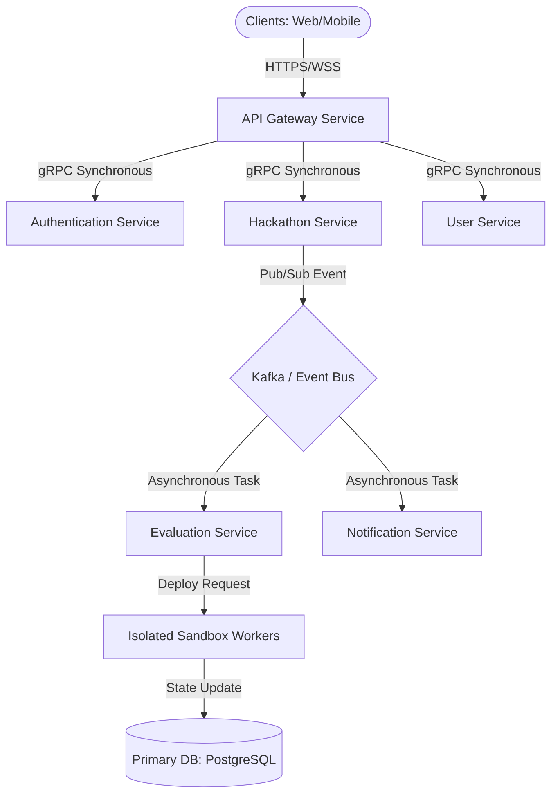

# Frontend Arena: Technical Architecture & Engineering Blueprint

This document defines the complete system architecture, service boundaries, database design, API guidelines, security models, evaluation engine pipelines, and devops infrastructure for **Frontend Arena**, serving as the official technical reference for backend, frontend, devops, and security engineering teams.

---

## Section 1: System Architecture

### 1. High-Level Architecture Diagram
Frontend Arena utilizes a **Modular Microservices Architecture** fronted by an API Gateway. Highly decoupled services communicate asynchronously via a message broker for heavy tasks (evaluation, notifications) and synchronously via gRPC/Protobuf for internal RPCs.



### 2. Service Boundaries & DDD Domains
*   **Core Domain:** Hackathons, Submissions, and Evaluation (High-frequency execution, strict isolation).
*   **Supporting Domain:** Identity & IAM, Teams, Leaderboards, Certificates, Billing, Notifications.
*   **Generic Domain:** Search, Media CDN, Analytics logs.

---

## Section 2: Service Architecture (19 Core Services)

Every microservice is packaged as an independent container and maintains its own datastore (Database-per-Service pattern).

1.  **Gateway Service:** Dynamic routing, TLS termination, SSL termination, and platform rate-limiting.
2.  **Auth Service:** OAuth2, SAML/OIDC federations, JWT token issuance, and session checks.
3.  **User Service:** Profile management, skill registry data, and XP milestone progression.
4.  **Organization Service:** Tenant metadata, custom subdomain configs, and organization hierarchy mappings.
5.  **Hackathon Service:** Event timelines, track rules, and registration configurations.
6.  **Registration Service:** Attendee check-in approval workflows and attendee lists.
7.  **Team Service:** Team matchmaking, invitations, and member role configurations.
8.  **Submission Service:** Git sync webhooks, submission logs, and assets storage links.
9.  **Evaluation Service:** Coordinates sandbox execution schedules and aggregates manual/AI grading outputs.
10. **Leaderboard Service:** Event-specific rank caching and dynamic position updates.
11. **Notification Service:** Delivery queue router (Email, WhatsApp, SMS, push notifications).
12. **Certificate Service:** Generates cryptographically signed PDF credentials.
13. **Media Service:** Processes images, screenshots, and logs storage lifecycles.
14. **Search Service:** Indices management for fuzzy candidate and project lookups.
15. **Analytics Service:** Aggregates telemetry records and generates usage reports.
16. **Billing Service:** Subscription invoices, Stripe integration, and licenses manager.
17. **AI Service:** Processes code summarization and automated plagiarism audits.
18. **Recruitment Service:** Recruiter portfolios lists and candidate shortlists.
19. **Admin Service:** Root system health dashboard operations and feature flag controls.

---

## Section 3: Database & Caching Architecture

*   **Primary Relational Database:** PostgreSQL (configured with Hot Standbys and Read Replicas). Houses transactional domain states (users, registrations, teams).
*   **High-Performance Cache & Session Store:** Redis Cluster (handles leaderboard ranking caches, active user sessions, and API rate-limiting trackers).
*   **Search Engine:** Elasticsearch (houses indexes for fast multi-dimensional recruiter candidate and project searches).
*   **Data Warehouse & Logging Storage:** ClickHouse (handles audit logs, telemetry analytics, and historical evaluation pipeline logs).
*   **Object Storage:** AWS S3 / Cloudflare R2 (houses raw screenshots, PDF certificates, and media files, fronted by Cloudflare CDN edge cache).

---

## Section 4: API Architecture Guidelines

### 1. REST Standards
*   All endpoints utilize lowercase, plural nouns (e.g., `/api/v1/hackathons/{id}/teams`).
*   Responses must return standard HTTP status codes:
    *   `200 OK` / `201 Created`
    *   `400 Bad Request` (Payload errors)
    *   `401 Unauthorized` / `403 Forbidden` (Invalid/insufficient tokens)
    *   `429 Too Many Requests` (Rate limit exceeded)

### 2. Error Payload Format
```json
{
  "error": {
    "code": "INSUFFICIENT_PERMISSIONS",
    "message": "User does not have permission to modify this team resource.",
    "details": {
      "required_role": "Team Captain"
    },
    "timestamp": "2026-07-27T23:52:26Z"
  }
}
```

---

## Section 5: Authentication & Security Framework

*   **Token Authorization:** Cryptographically signed **RS256 JWT tokens** containing tenant configurations and RBAC/ABAC role claims.
*   **Secrets Storage:** HashiCorp Vault (stores database credentials, API integrations keys, and SSL certificates).
*   **Key Rotation:** Automatic key rotations for JWT signing certificates every 90 days.

---

## Section 6: Evaluation Engine Pipeline Spec

The evaluation engine compiles and tests submitted code repositories within isolated, ephemeral container sandboxes.

```
[Trigger webhook] -> [Download repo] -> [Run Docker sandbox] -> [Execute tests] -> [Push logs] -> [Teardown]
```

### 1. Sandbox Execution Pipeline
1.  **Isolation Boundary:** Docker containers configured with gVisor runtimes to secure kernel execution.
2.  **Resource Limits:** Max execution duration `300s`, max memory allocation `2GB`, CPU quota `1.5 cores`, networking disabled during compilation.
3.  **Failure Recovery:** If a worker crashes, the scheduler recaptures the job state from Redis, logs the worker failure, and redirects the task to another healthy worker.

---

## Section 7: Real-Time Telemetry System

*   **WebSocket Infrastructure:** Socket.io cluster backed by a Redis Adapter Pub/Sub system for scaling connections across node servers.
*   **Use Cases:** Pushing live leaderboard rank updates, submission progress checkmarks, and active worker CPU metrics.

---

## Section 8: DevOps, Infrastructure & CI/CD

### 1. Infrastructure as Code (IaC)
*   Terraform scripts manage AWS/GCP resources (VPCs, RDS instances, Kubernetes node pools).

### 2. Container Orchestration (Kubernetes)
*   **Deployments:** Deployed on EKS / GKE clusters. Horizontal Pod Autoscaling (HPA) scales pods based on CPU consumption spikes (`> 75%` utilization).

---

## Section 9: Engineering Standards & Tech Stack Recommendations

### 1. Recommended Stack
*   **Frontend Web:** Next.js (React 19) + TypeScript + Tailwind CSS (configured to use design tokens).
*   **Mobile App:** React Native (Expo) sharing UI components.
*   **Backend Services:** Node.js (TypeScript/NestJS) for Gateway/IAM, Go (Golang) for fast microservices (Leaderboards, Notifications, Evaluation).
*   **Messaging System:** Apache Kafka (highly scalable messaging broker).

### 2. Git Branching Strategy
*   `main` — Represents production deployments.
*   `develop` — Core integration branch for active features.
*   `feature/*` — Local developer feature branches. Enforces squash merges and requires passing CI tests (linting, unit tests) and 2 peer approvals.
